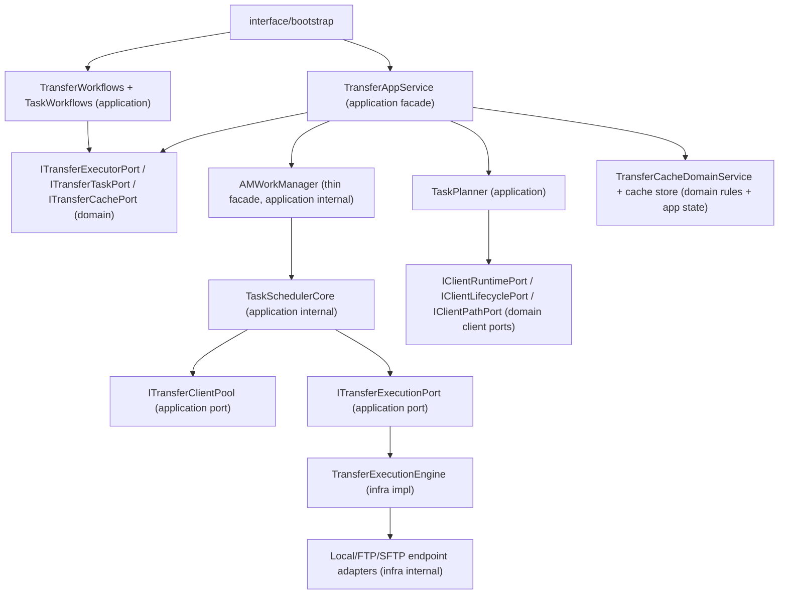

# Translation

Finally, all functions need to be bound to the CLI. Users can invoke the program in two ways:

## Direct CLI Invocation (Non-interactive Mode)

+ Invoked directly via terminal
+ Commands are parsed by CLI11
+ If a function needs to create a client during execution, it creates one directly without prompting the user
+ All functions involving network I/O must:
  - Set a timeout (read from settings, default 5 seconds)
  - Add an `interrupt_flag` (preferably a global static variable with a prefix to avoid naming conflicts)
+ Capture Ctrl-C signals and convert them to activating the `interrupt_flag` for graceful termination
+ Exit the program immediately after operation completion, with the exit code set to the function's return value

## Interactive Invocation

Not required for current implementation, but extensibility and compatibility must be considered for future support:

+ Use `replxx` prompt to receive user commands
+ Parse commands manually, maintaining full compatibility with all non-interactive mode commands
+ Rich auto-completion features:
  - Tab completes uniquely matched items
  - **Completion menu**
  - Command completion
  - Path completion:
    - Delay completion search for a short period after output stops
    - Load completion items asynchronously to avoid blocking normal input
+ Input history:
  - Maintain independent history records for different hosts
+ Additional special commands:
  - Commands starting with `!` execute shell commands (not supported by FTP client)
  - Commands ending with `&` run in background (supported by select functions)

## Non-interactive Mode

@amio.cpp

CLI binding can be implemented using the `CLI11.hpp` library. Refer to `amio.cpp` for concrete usage examples.

The program exits with the function's returned `exit_code`.

**Current is just the first version, remain some place for improve and new features**

Below are the functions requiring CLI binding:

### `config` (subcommand)

+ `ls`
  - `-d` (detail): calls `AMConfigManager::List()`
  - Without `-d`: calls `AMConfigManager::ListName()`
+ `keys`: calls `AMConfigManager::PrivateKeys()`
+ `data`: calls `AMConfigManager::Src()`
+ `get`: calls `AMConfigManager::Query()`
+ `add`: calls `AMConfigManager::Add()`
+ `edit`: calls `AMConfigManager::Modify()`
+ `rename`: calls `AMConfigManager::Rename()`
+ `rm`: calls `AMConfigManager::RemoveHost()`
  - Supports batch deletion with space-separated hostnames

### Filesystem-related Functions

No subcommand required; callable directly.

+ Support `{nickname}@{path}` path format. After creating the client, execute operations directly without user confirmation for client creation.
+ Support special paths containing spaces when wrapped in double quotes (`""`)
+ Set a global `interrupt_flag` to allow users to gracefully terminate the program
+ `stat`

  - Accepts multiple paths separated by spaces
+ `ls` (accepts only a single path)

  - `-l` → `list_like`
  - `-a` → `show_all`
+ `size`

  - Calls `AMFileSystem::getsize()`
  - Accepts multiple paths:
    - `path1: size1`
    - `path2: size2`
+ `find` (accepts only a single path)
+ `mkdir`

  - Accepts multiple paths
    - ❌ `{rc}: Fail to mkdir path1, {msg}`
    - ✅ `Success to mkdir path2`
+ `rm`

  - Supports multiple paths
  - Prints results in the same style as `mkdir`
  - New `permanent` parameter:
    - When `true`: calls client's `remove()` function
    - When `false`: calls client's `saferm()` function
    - `AMFileSystem::rm` requires enhancement to support this
+ `mv`

  - Maps to `move` operation
+ `rename`

  - Maps to `rename` operation
+ `tree`

  - `-d`: specify maximum traversal depth
  - `-a`: print hidden directories and files
    - Default `false`: excludes entries starting with `.`
+ `walk`

  - `-d`: print directories only
  - `-f`: print files only
+ `trashdir`

  - Without argument: prints current trash directory path
  - With argument: sets the trash directory
    - On success, updates the configuration accordingly
+ `buffersize`: behaves similarly to `trashdir`
+ 

@./tomlread

@include\AMConfigManager.hpp

@config\config.toml

@config\settings.toml

@tomlread\src\lib.rs

我现在需要改用rust的库来读取和写入toml文件, rs文件目录已给出, 目前还存在编译报错

I want use rust lib to read and write toml file, rs src dir is given above, but there's still compile error, correct it

error[E0382]: use of moved value: `item`
   --> src\lib.rs:460:17
    |
407 | fn apply_json_updates_append_new(item: &mut Item, j: &J) {
    |                                  ---- move occurs because `item` has type `&mut Item`, which does not implement the `Copy` trait
408 |     match (item, j) {
    |            ---- value moved here
...
460 |                 *item = new_item;
    |                 ^^^^^ value used here after move

I have nlohmann-json for json-parse

expose rust functions to C++, and use these functions to improve

configprocessor in @include\base\AMCommonTools.hpp

produce a format json shcuema file
@src\AMConfigManager.cpp

@include\AMConfigManager.hpp

- Replace `AMConfigManager::Status` with the `ECM` type.

  - If no corresponding code exists in `EC`, create a new one.
- Remove redundant checks in `AMConfigManager::EnsureInitialized`.
- Move generic prompt-related functions from `AMConfigManager` to `PromptManager` (excluding format-customized functions like `PromptModifyFields`).
- Remove the redundant function `AMConfigManager::StyledValue`.
- Replace `AMConfigManager::MaybeStyle` with direct usage of `Format`.
- Add a new field `login_dir` to `ClientConfig`.
- `AMConfigManager::GetClientConfig` must read **all** fields from `ClientConfig`.

  - If a field is missing, assign its default value.
  - Persist these default values back to the config file.
- Provide two utility functions:

  ```cpp
  bool QueryKey(Settings/config, AMConfigProcessor::Path, &value) {
      // Match and retrieve the value at the specified path.
      // Return false if the path does not exist or the value type mismatches.
  }
  ```

  ```cpp
  template<typename T>
  bool SetKey(Settings/config, AMConfigProcessor::Path, T value) {
      // Set/modify the value at the specified path.
      // Create the path if it does not exist (template function).
  }
  ```
- Enhance `AMConfigManager::Delete` to accept **multiple targets** (space-separated).
- Enhance `AMConfigManager::Query` to accept **multiple targets** (space-separated).
  @include\AMFileSystem.hpp

@src\AMFileSystem.cpp

## Optimize AMFileSystem

### move

+ Support multiple source paths
+ Options for `mkdir` (auto-create parent directories) and `overwrite`
+ Cross-client operations not allowed
+ Support for interrupt and timeout control

### rename

+ Accepts only one source and one destination path
+ If destination is in path format (detected by `/` or `\\`), rename source to the full destination path
+ If destination is not in path format, replace the source filename with the destination name
+ Cross-client operations not allowed
+ Options for `mkdir` and `overwrite`
+ Support for interrupt and timeout control

### walk

+ Actually delegates to the client's `iwalk`, printing all subpaths under a given path
+ Supports flags `-f` (files only) and `-d` (directories only)

### tree

+ Uses the client's `walk` to retrieve directory structure
+ Implements a function to print the hierarchy in Unix-style `tree` format

### realpath

+ Internally uses `AMFS::abspath`, but resolves home and working directory using the client's context

---

## Add Client Information Query Functions

If no client name is provided, query the current client; raise an error if the client hasn't been created.

+ `GetProtocol`
+ `TrashDir`
+ `HomeDir`

## Add Client Parameter Modification Functions

+ `SetTrashDir`: Change the client's trash directory. Note: after successful update, the configuration file must also be modified accordingly.
+ `SetBufferSize`: Modify the client's buffer size.
  @include\AMClientManager.hpp

## Improve AMClientManager

I want to support passing a `quiet` parameter when creating a client.

- When `quiet` is **false** (default), the creation process—primarily the connection phase—should display a live status line:

  `{dynamic indicator}  Connecting to SFTP/FTP Server   [{nickname}]`

  where `{dynamic indicator}` is a rotating spinner or similar visual cue that updates in place.
- When `quiet` is **true**, suppress all such output. Additionally, temporarily suspend any logging during the authentication callback (`authcb`) phase.

@include\AMFileSystem.hpp

@src\AMFileSystem.cpp

AMFileSystem::connect

+ 支持接收多个client
+ 单个client创建失败打印错误但不停止

AMFileSystem::change_client

+ cleint不存在直接调用manager的addclient创建, 不需要再询问

AMFileSystem::cd

+ cd - 时, 直接清空last_cd_, 在调用一次cd last_cd_(copied)即可, 减少代码复杂度
+ 

# Improve ClientManager

@include\AMClientManager.hpp

- Treat `LocalClient` the same as other regular clients: initialize it by reading the config entry with nickname `"local"`.
- Change `AMClientManager::client_maintainer` to be held by a **shared pointer** (`std::shared_ptr`).
- Remove the `ClientMaintainerRef& ResolveMaintainer_()` function.Replace its usage sites with a ternary operator (`condition ? a : b`).
- When a `Client` is created:

  1. Read the `login_dir` field from the client's config.
  2. If the value is missing **or** the path does not exist:
     - Fall back to `home_dir`
     - Persist this fallback value back to the config file
  3. Store the resolved directory path in `client->public_kv["workdir"]`.
- Remove the `CreClient()` function.

## Improve AMFilesystem

- `AMFileSystem::check` should accept multiple clients as input.
- Add a new function `AMFileSystem::sftp`, corresponding to `ClientManager::Connect` but with the protocol fixed to SFTP. Upon successful connection, automatically switch to the newly created client.
- Add a new function `AMFileSystem::ftp`, with the same behavior as above but with the protocol fixed to FTP.
- `remove_client` should accept multiple target clients, but prompt for confirmation only once collectively.
- `AMFileSystem::stat` should accept multiple targets and print their status information one by one.
- `AMFileSystem::getsize` should accept multiple targets and print each target's size on a separate line.
- General-purpose functions related to `treeNode` creation and printing in `AMFileSystem::tree` should be moved to `CommonTools` for reuse.
- `mkdir` and `rm` should support multiple target paths for batch operations.
- Remove `AMFileSystem::NormalizeNickname`; replace all usages with `AMStr::lowercase()`.
- Remove `AMFileSystem::PromptYesNo`; use the confirmation prompt functionality provided by `PromptManager` instead.
- Replace `AMFileSystem::IsAbsolutePath` with `AMPathStr::IsAbs`.

## 优化AMSFTPCli.cpp

每个函数拥有自己的参数的struct

CliOptions 换为CliArgsPool, 存储所有的函数的参数struct

CliArgsPool{

auto ls = ConfiglsArg{

path =
list_like
show_all
interrupt_flag(不包括, 因为本质上interrupt_flag用于内部控制, 不是操作的参数)

timeout_ms(也不包括, 因为可以随时终止, timeout_ms意义不大了)

}

}

将绑定参数的操作独立出来成一个新文件AMCLIBind.hpp
封装一个函数: 参数为cli_commands, 以及一个存储各个manager的共享指针的struct, 在函数中根据指令执行操作, 返回值暂时设置为void

# Non-Interactive Improve

部分非交互的cli函数比较特殊, 因为它们是交互模式的入口, 所以需要修改并新添部分函数, 可通过DispatchCliCommands函数的返回值设定

+ bash: 直接进入交互模式
+ sftp/ftp : 连接成功后进入
+ connect: 连接成功后进入

# Interactive Mode

交互模式的函数依旧绑定到CliCommands, 但是在DispatchCliCommands中不分配执行, 即cli_commands.sub_commands()读取到指令但是DispatchCliCommands中没有执行的情况.

DispatchCliCommands暂时不需要更改, 先完成交互模式的函数绑定

# check

real_func: AMFileSystem::ECMAMFileSystem::check(conststd::vector[std::string](std::string) &nicknames, amfinterrupt_flag)

 ClientRefclient = resolve_by_name(name);

这里返回结果需要更详细, 是client未建立还是config不存在, 而且还要打印信息

+ 同时也需要包括其他函数比如cd
+ 返回的ECM只是用于设置状态, 出错时需要在函数内部打印错误信息
  + 格式 ❌ {cli_func_name}: {msg}

# ch

real_func:

AMFileSystem::change_client(conststd::string&nickname,amfinterrupt_flag)

# disconnect

AMFileSystem::remove_client

# cd

AMFileSystem::cd

# clients

AMFileSystem::print_clients

# Improve Transfer Manager

取消初始化参数, 因为各类manager都是单例模式, 可以直接通过函数获取

tm需要增添一些功能

+ 新增一个UserTransferSet的cache池, 并设置函数让用户提交新set, 查看已有的set以及删除某些不需要的se
  + 当然, 还需要设置一个函数执行这些transferset
+ show: 可以使用TaskInfoPrint::Show, 但是这个show接收ID和flag
+ list: 使用TaskInfoPrint::List, 但接收的时三个pending, finished, conducting bool option和一个flag
+ inspect: 接收ID, set, entry 两个bool option. 以及两个衍伸函数
  + userset: 接收ID
  + taskentry: 接收ID
+ 以及一些控制任务的函数
  + terminate
  + resume
  + pause

# Non-Interactive Improve

部分非交互的cli函数比较特殊, 因为它们是交互模式的入口, 所以需要修改并新添部分函数, 可通过DispatchCliCommands函数的返回值设定

+ bash: 直接进入交互模式
+ sftp/ftp : 连接成功后进入
+ connect: 连接成功后进入

# Interactive Mode

交互模式的函数依旧绑定到CliCommands, 但是在DispatchCliCommands中不分配执行, 即cli_commands.sub_commands()读取到指令但是DispatchCliCommands中没有执行的情况.

DispatchCliCommands暂时不需要更改, 先完成交互模式的函数绑定

# check

real_func: AMFileSystem::ECMAMFileSystem::check(conststd::vector[std::string](std::string) &nicknames, amfinterrupt_flag)

 ClientRefclient = resolve_by_name(name);

这里返回结果需要更详细, 是client未建立还是config不存在, 而且还要打印信息

+ 同时也需要包括其他函数比如cd
+ 返回的ECM只是用于设置状态, 出错时需要在函数内部打印错误信息
  + 格式 ❌ {cli_func_name}: {msg}

# ch

real_func:

AMFileSystem::change_client(conststd::string&nickname,amfinterrupt_flag)

# disconnect

AMFileSystem::remove_client

# cd

AMFileSystem::cd

# clients

AMFileSystem::print_clients: 该函数需要新加detail 的option, 设置时才需要打印状态, 不设置只需要打印名称即可

# task 子命令

以下函数在task子命令下

+ cache子命令

  + add : 添加userset, 签名和cp相同
  + rm: 可接收多个index
  + clear: 清除cache
  + submit : 生成taskinfo并提交, 设置quiet参数, 非quiet模式下需要打印userset信息,  并确认
    + 提交成功才清空cache
    + 空cache提交报错
+ show(函数)
+ list

  + AMTransferManager::List的三个option都不传入时,默认全打印
+ show

  + AMTransferManager::Show, flag由内部传入(一般是amgif)
+ inspect

  + 新增一个show_info
  + 三个option均未传入时, 使用show_info
  + 否则, 传入什么打印什么
+ terminate

  + workermanager的terminate函数需要改进一下， 应该直接从registry中找任务, 并根据任务状态执行.返回 `pair<`taskinfo `, bool>` 后者代表是否终止成功(已完成的任务无法终止)
  + 同样, get_task(constTaskId&id)也需要更改
  + 
  + 所有任务控制函数都支持批量操作, 而且每个需要打印结果
+ pause
+ resume
  命令的解析使用CLI11, 但是在交互模式下, 需要对用户输入的原始命令字符串进行预处理解析

所以需要有一个指令的预处理系统

# var函数

+ 该函数文件中没有定义, 需要实现
+ 该函数用于变量定义, 为了使用方便, 不需要对$转义, 所以改函数的参数不能进行解析, 甚至不经过CLI11解析
+ 检测到var关键字, 除非开头有!标识, 否则直接传给var
+ ${name} = {value} 的类型也需要传给var

# 内置符号

内置符号在传入CLI11前, 需要被解析并替换

+ ! 在开头代表将指令作为作为终端命令指令(调用ConductCmd)

  + 只有SFTPClient支持ConductCmd
  + 其他client类型报错
+ & 在结尾, 且函数为transfer以及task submit时, 用于异步执行

  + 不符合要求时, 不进行剥离
+ $ 符号, 是用于用户自定义变量的替代

## $ 引用系统

### 定义

+ setting中读取内置值

  + 在UserPaths中, 所有变量值只能是字符串
+ 内存定义

  + $arg_name = yeshahah
  + 定义在内存中, 程序重启后丢弃
  + 覆盖值时, 需要确认
    + 确认的prompt需要区分覆盖的时内置值还是内存值
+ 内置定义

  + 使用var ${name}={value} 定义
    + 写入内存, 并且写回config
    + 覆盖时依旧需要确认
+ 命名规范

  + 英文大小写, 数值, 和下划线
  + 不规范时报错提醒
  + 变量名区分大小写
+ 格式规范

1. 变量名与=之间可以有空格
2. 变量值与等号之间的空格不计入值中, 变量值需要两端strip
3. 变量值不需要引号包裹(因为值只能是字符串类型)
4. 但是也需要兼容被引号包裹的情况
   1. 若完全包裹 "  asdas   ": 则去除引号
   2. 若不完全包裹 "   asd   "bd  : 则报错

### 引用使用规范

+ $dsk/test1  \$dsk\test1

  + $解析名称时, 遇到非法符停止
+ $(dsk)1

  + 人为可以用()包裹目标
  + 若使用了$(但是括号不闭合, 需要报错
+ 原始路径中存在$

  + 若匹配的的名称不存在, 则返回不解析, 返回原字符串
  + 若$被`转义, 不解析
+ 解析若成功, 则使用字符串替换即可

# Command Preprocessing System

Command parsing is handled by CLI11. However, in interactive mode, raw user input strings require preprocessing before being passed to CLI11.

Therefore, a dedicated **command preprocessing system** is needed.

ps: any blankspace in front of a command is allowed and ignored

---

## `var` Function

+ This function is not yet implemented and needs to be added.
+ It is used for variable definition. For usability, **no `$` escaping is required**, meaning its arguments must **bypass CLI11 parsing entirely** and remain unparsed.
+ When the keyword `var` is detected at the beginning of a command (unless prefixed with `!`), the entire line should be routed directly to the `var` handler.
+ The syntax `${name} = {value}` must also be supported and forwarded to `var`.

---

## Built-in Symbols

Built-in symbols must be parsed and replaced **before** the command string is passed to CLI11:

+ **`!` at the beginning**Indicates the command should be executed as a native shell command via `ConductCmd`.

  + Only `SFTPClient` supports `ConductCmd`.
  + Other client types must return an error.
  + strip ! and return, don't parsing Variable Reference
  + ignore leading blankspace; if first non-space is `!`, treat as shell mode; otherwise `!` is literal
  + if ! is leagal, remove !,  strip blankspace, end parsing and call `ConductCmd`
+ example

  + ! ls .    ->   ls .
  + ls !. -> ls !.
  + ls . ! -> ls .!
  + !ls-> ls
  + ! ls -> ls
+ **`&` at the end**Used for asynchronous execution when the command is `cp` or `task submit`.

  + If conditions are not met (wrong command or position), return an error; do not treat `&` as literal input.
  + example

    + cp path1 path2 &  -> cp path1 path2
    + cp path1 path2& ->  cp path1 path2&    (& not a token, it's in the path)
    + ls  path1& ->  ls  path1&
    + ls  path1 & -> Return Error:  & not permited in functions except cp and task submit(Not Literal, you need to return an error)
+ **`$` symbol**
  Used for substituting user-defined variables.

---

## `$` Variable Reference System

### Definition Sources

+ **Built-in values from settings**

  + In `UserPaths`, all variable values must be strings.
+ **In-memory definition**

  + Syntax: `$arg_name = yeshahah`
  + Stored in memory only; discarded on program restart.
  + Overwriting requires confirmation.
    + The confirmation prompt must distinguish whether the value being overwritten is built-in or in-memory.
+ **Persistent definition**

  + Syntax: `var ${name}={value}`
  + Writes to both memory and config file.
  + Overwriting still requires confirmation.

### Naming Rules

+ Allowed characters: letters (case-sensitive), digits, and underscores (`_`). can startwith any allowed char
+ Invalid names trigger an error with a reminder.
+ Variable names are **case-sensitive**.

### Format Rules

1. Whitespace is allowed between the variable name and `=`.
2. Leading/trailing whitespace around `=` is **not** part of the value; values must be stripped.
3. Quotation marks are **not required** (values are always strings).
4. Quoted(" or ') values must be handled compatibly:
   a. Fully wrapped (e.g., `"  asdas   "`): strip outer quotes.
   b. Partially or malformed quotes (e.g., `"   asd   "bd`): report an error.
5. leading and tailing blankspace of name/value/command will be removed

### Reference Usage Rules

+ `$dsk/test1`

  + Variable name parsing stops at the first illegal character.
+ **`${dsk}1`**

  + Parentheses {}can be used to explicitly delimit the variable name.
  + Unclosed `${...}` must trigger an error.
  + invalid names inside {} cause no substitution and keep original.
+ **Literal `$` in paths**

  + If the referenced variable name does not exist, the original string is preserved (no substitution).
  + Escaped `$` (via backtick `` `$ ``) is not parsed.
  + \\ can't escape $
+ **Successful substitution**

  + Performs simple string replacement at the reference site.
  + recursive substitution is not allowed
    + $a = b
    + $b = c
    + $a expands to $b (literal), not c

## TokenType Analyser

replxx::Replxx rx;
rx.set_highlighter_callback([](std::string const& input, replxx::colors_t& colors){
});

用于实现input的语法高亮, 我需要一个解析器, 并实现上述回调

Token类型包括

module(task, config)

command

variable(`$varname  ${varname}`)

value (value of the variable)

nickname

option(-f -d)

atsign(只是真实生效的@, 即前面的nickname在config中)

dollarsign(`不包括转义的$, 且在后面跟着的变量名合法时生效, 但不检测变量是否存在`)

## DispatchCliCommands优化:

返回类型改为ECM

在函数最前方检测有没有subcommand匹配到, 打印错误, 返回错误

在函数下方验证是否为Interactive模式, 非交互模式退出, 返回EC::OperationUnsupported, {cmd_name} not supported in Non-Interactive mode

然后继续写分派执行交互模式函数的逻辑

# Interactive Loop

交互模式本质是一个询问指令->执行指令->询问指令的循环

但我需要对这个循环进行一定的设置

## 整体流程

1. 使用replxx库获取用户输入
2. 如果命令在去除两段空格并且转小写后为exit, 则清理资源退出程序
3. 使用CommandPreprocessor预解析参数
   1. 部分函数会在预处理阶段执行
   2. 部分操作可能在预处理阶段完成
4. 使用CLI11 解析命令(部分情况会跳过)
5. 解析失败则打印CLI11的报错信息
6. DispatchCliCommands执行命令
7. 获取执行结果更新input中的状态信息

## Input Custom

+ Prompt

  + 格式为
  + sysicon在setting.toml中, 需要结合GetOSType选择适当的图标
  + EC从函数返回值取
  + 复制生成Input可以缓存一个当前nickname的变量, 可以检测这个变量是否改变, 决定是否更新{sysicon} {username}{hostname}{nickname}

  {sysicon} {username}@{hostname}  {last_eplased}  ✅/❌ {EC_name if not success}

  ({nickname}){work_dir} $
+ input函数的注意点

  1. 需要额外的prompt的函数, 并为将来的补全留下接口(刚才提到的Completer)
  2. input 还需要set_highlighter_callback
  3. 该input函数不和PromptManager里的其他prompt函数共享replxx句柄, 但他的句柄仍由PromptManager管理
  4. 初始化时注册COREPROMPT HOOK, 效果类似PROMPT, 但目标是本句柄
  5. 该input前需要激活信号处理器中的COREPROMPT, 重置amgif(不重置iskill)
  6. 获取input内容后需要检查amgif
     3.1 如果amgif的iskill触发, 则清理资源退出
     3.2 如果amgif的is_interrupted触发, 则打印信息告诉用户如何退出(输入exit), 然后continue
  7. 获取input后需要沉默COREPROMPT
  8. 如果用户输入内容为空或者全是空字符, continue
     @InteractiveLoop.cpp

line 276 monitor.ResumeHook("COREPROMPT");

COREPROMPT这个钩子注册了吗?

ECMrcm = ExecuteShellCommand_(prompt, client_manager, config_manager,

    pre_result.command);

这个函数返回类型为ConducCmd的CR

返回后先检测EC是否success,

是success的话需要打印msg, 然后换行打印
Command exit with code {code}

elapsed_time时从用户确认输入的时间, 到命令执行完, 进入下一个循环前的时间

修复这些问题,然后在main.cpp中生成主函数入口
@InteractiveLoop.cpp

@main.cpp

Line 276: `monitor.ResumeHook("COREPROMPT");`

Has the "COREPROMPT" hook been registered?

```cpp
ECMrcm = ExecuteShellCommand_(prompt, client_manager, config_manager,
    pre_result.command);
```

This function returns a `CR` of type `ConducCmd`.

After returning, first check whether `EC` is successful.
If it is successful, print the `msg`, then print a newline followed by:

```
Command exit with code {code}
```

`elapsed_time` refers to the duration from when the user confirms their input until the command execution completes—just before entering the next loop iteration.

Fix these issues, then generate the main function entry point in `main.cpp`.
@InteractiveLoop.cpp

ResolveSysIcon_中, icon是[#3490de]icon[/]格式, 需要尝试对其进行ANSI转义, 格式不对再返回原字符串

SplitCommandLine_(pre_result.command, &argv, &parse_error)

这个是没必要的, 调用CLI交给它解析
CLI::App::parse(std::string commandline, bool program_name_included=false)

后续的argv.insert(argv.begin(), app_name);也没必要

# All Functions below are used in Interacctive Mode

## check

real_func: `AMFileSystem::ECM AMFileSystem::check(const std::vector<std::string>& nicknames, amf_interrupt_flag)`

```cpp
ClientRef client = resolve_by_name(name);
```

The return result needs to be more detailed—distinguish between "client not established" and "config does not exist"—and error messages must be printed accordingly.

+ This requirement also applies to other functions such as `cd`.
+ The returned `ECM` is only used to set the status. When an error occurs, the function itself must print the error message internally.
  + Format: `❌ {cli_func_name}: {msg}`

## ch

real_func:
`AMFileSystem::change_client(const std::string& nickname, amf_interrupt_flag)`

## disconnect

`AMFileSystem::remove_client`

## cd

`AMFileSystem::cd`

## clients

`AMFileSystem::print_clients`: This function requires a new `detail` option. When enabled, it should print the client status; otherwise, it should print only the client names.

## Input History

需要对交互模式的input新加一个历史命令功能

使用上下键可以切换历史指令(注意不能和补全菜单冲突, 有补全菜单时优先选择补全项目, 沉默历史指令选择)

历史命令存在项目目录的config/internal/history.toml中

注意需要以 nickname = list(cmd)的形式保存, 不同client不共享历史命令

文件由ConfigManager管理, PromptManager向其读取

历史最大entry最大数目为settings.InternalVars.MaxHistoryCount

+ 最小值与默认值均为10

PrompManager负责将历史数据写入replxx中

向上键往前翻, 向下键往后翻

但末尾有两个临时条目(在选择时启用但不加入历史中)

+ 在使用上下键使用历史前已经input的内容(如果空, 则不启用)
+ 空白条目, 用于清空input

在input返回且内容不为空且COREPROMPT钩子没有被触发时, 加入prompt到历史中

程序退出时,获取replxx的history写回config/internal/history.toml
sftp, ch, ftp, connect连接成功后, 或切换到该client

CLI11在非交互模式下无法通过-h打印使用说明,  而是返回This should be caught in your main function, see examples

新设一个CLIBind.cpp, 将CLIBind.hpp中函数的具体定义移到其中

CliCommands中存一个CLI的app的指针, DispatchCliCommands中获取const bool any_parsed =可以用app.get_subcommands()方法(去查header找函数)

# 以下是关于CLI绑定及其对应工作函数的修改

ps: 在add_subcommand, 尽量将相关的函数放在一起

config的ls的-d选项改名为-l, --list  效果等同

config 添加一个函数SetHostValue, 绑定cli名称为set(在config subcommand中), 函数可在非交互模式下使用

config set wsl  username haha

set在cli中接收有且仅有三个字符串(nickname, 属性名, 属性值), 需要在SetHostValue中解析

nickname不存在, 属性名不存在, 或者属性值非法 都报错

更改成功时需要提示, 案例:  wsl.username:   am  ->   haha

config绑定一个save函数, 对应dump, 无需参数

host的config新加一个compression的字段, 字段排序(打印或者询问用户时)

nickname="wsl"

hostname="172.26.36.83"

username="am"

port=22

password="enc:70746B72"

protocol="sftp"

buffer_size=-1

trash_dir="/home/am/trash"

login_dir="/home/am"

keyfile=""

compression=false

新增一个client subcommand(和config, task类似 ), 并在该子命令下添加子命令

ls (支持-l, --list选项)对应原绑定:

commands.clients_cmd=app.add_subcommand("clients", "List client names");

  commands.clients_cmd->add_flag("-d,--detail", args.clients.detail,"Show full status details");

check  对应原绑定:

  commands.check_cmd=app.add_subcommand("check", "Check client status");

  commands.check_cmd ->add_option("nicknames", args.check.nicknames, "Client nicknames")->expected(0, -1);

rm 对应原绑定:

  commands.disconnect_cmd=

    app.add_subcommand("disconnect", "Disconnect clients");

  commands.disconnect_cmd ->add_option("nicknames", args.disconnect.nicknames, "Client nicknames to disconnect")->expected(1, -1);

以下指令我做了修改, 你保证其他地方一致性

  commands.task_list_cmd=commands.task_cmd->add_subcommand("list", "List tasks");

  commands.task_inspect_cmd=commands.task_cmd->add_subcommand("inspect", "Inspect a task");

  commands.task_userset_cmd

    ->add_option("index", args.task_userset.index, "Cache index")

    ->expected(0, -1);

可接收任意数量的index, 但需要对index进行去重

没有index传入打印所有cached的userset

  commands.task_taskentry_cmd=

    commands.task_cmd->add_subcommand("taskentry", "Inspect task entry");

  commands.task_taskentry_cmd->add_option("id", args.task_entry.id, "Entry ID")

    ->required()

    ->expected(1, 1);

改名为query, 可1+个ID
@

@src\manager\Transfer.cpp

封装一个函数CollectClients, 接收vector `<nicknames>`, 返回pair `<ecm, maintainer_ptr>`用于根据需要的client创建maintainer, 逻辑类似PrepareTasks_中的相关操作

将PrepareTasks_返回值修改成pair<ECM, TaskInfo_ptr>, 添加两个参数quiet,interrupt_flag,   PrepareTasks_中完成生成TaskInfo的操作(但结果回调在两类transfer中)

ReturnClientsToIdle_直接接收ClientMaintainer, 读取ClientMaintainer.hosts将所有非local的clients添加回公有池

transfer_async和transfer添加直接接收taskinfo的重载

修复transfer中progress的bug, transfer只提交一个任务, 用不着进度条组

TaskInfo持有maintainer的共享指针

TaskInfo新增 attr  vector `<str> nicknames`

TaskInfo在AMTransferManager::ResultCallback中将maintainer的client放回后, 设为nullptr释放

取消TransferManager中查询任务函数对maintainer调用

# Resume

新加resume用在已经失败的任务的重新提交/续传

resume接收两个参数

+ str id: 位置参数已经存在而且状态是已完成的任务的id, 非已完成的任务直接报错
+ bool: is_async = false
+ bool: quiet = false
+ vector `<int>` index: 接收可变数量的整数, 为TaskInfo的TASKS的指定任务的下标

先查询任务id是否合法

过滤非法的index(超界/负数), 过滤时需要警告用户这些index被过滤

根据index传输情况, 重新构造TASKS(已经IsSuccess的task不再重传)

分析需要的clients, 调用CollectClients创建maintainer, 若失败直接报错
调用workermanager的cre_taskinfo创建Taskinfo, 根据is_async 调用相关的transfer函数

## Completor Blueprint

### 1) 高层架构

- **补全流水线**：输入 → 解析cursor前的input → 构建查询 → 获取候选（同步/异步） → 排序/格式化 → 渲染 → 应用选择
- **核心类型**：
  - `CompletionContext`（光标位置、当前令牌、完整行、解析状态、模式）
  - `CompletionCandidate`（显示文本、插入文本、类型、帮助信息、评分、元数据）
  - `CompletionResult`（候选列表 + 匹配策略 + 延迟信息）
- **补全源（可选择开启与关闭）**：
  - `CommandSource`（命令/子命令/选项）
  - `InternalSource`（任务ID、客户端名称、主机配置昵称、变量名  以及一些内置属性名）
  - `PathSource`（本地/远程路径）
- **协调器（Coordinator）**：
  - 一个根据上下文分发请求至各补全源并合并结果的 `Completer`
  - **统一补全流程**：即使命令补全很快，也使用相同的 `CompletionRequest`流水线，确保UI行为一致，简化系统并提升可扩展性

### 2) 上下文解析

- 目前已经存在input解析器@src\cli\TokenTypeAnalyzer.cpp
- 支持引号、转义符和 `nickname@path`语法的令牌化
- **目标类型判定**   越靠前优先级越高 ：

  - 以!开头, 屏蔽补全, 因为时调用远程终端
  - input还没有有效命令 → 补全模块名或者顶层函数名
  - input存在有效模块名-> 补全该模块下的函数名
  - input存在有效函数

    - 以未被转义 `$`开头 → 变量名补全
    - 以 `--`开头-> 根据选项全称补全
    - 以 `-`开头 → 根据选项简写进行补全
    - 补全函数特有的参数

      - 例如config set 第一个参数时nickname, 第二个参数是config中各项属性的名称
      - task inspect 需要补全任务id
    - 出现路径的明显特征 如以/ , ~/, c:/, nickname@c开头
    - 1. 路径以/或\结果则获取该路径的所有子项目作为补全目标
      2. 否则, 遍历父级目录, 以匹配前缀的作为补全目标
  - 未触发以上规则, 不进行补全.
  - 触发一个规则后, 不再触发下面的规则

### 3) 候选模型

- **类型（kind）**：Module, Command, Option, VariableName, ClientName, HostConfigNickname, HostConfigAttrName, TaskId, PathLocal, PathRemote
- **字段**：
  - `insert_text`：实际插入内容
  - `display`：菜单中显示文本(被style化)
  - `help`：简要用法说明（命令尤为重要）
- **排序策略**：
  - 前缀匹配优先
  - 路径匹配时

    - regular文件优先
    - 其次文件夹
    - 然后链接文件
    - 最后其他特殊文件

### 4) 异步模型

- 每次输入都会产生一个请求ID, 修改输入时会改变请求ID并终止非该请求ID的补全任务，应用补全结果时核验请求ID, 自动丢弃过期的异步结果
- 补全远程路径时, 设置一个延时(用户可自定义), 在延时期内可以无成本地取消服务器请求, 减轻网络IO压力
- **补全缓存** : 主要需要存储路径补全的缓存,  包含 dir, nickname, vector `<PathInfo>`等属性即可, 如有其他需要的属性, 可以再添加. 其他补全存储在本地内存中, 无需缓存. 该缓存最好可以提供指令清除(因为路径会变动), 缓存的size也不宜过大
  - 只有文件夹内的子项目超过指定数量(用户设置)才进行缓存, 否则不进行缓存

### 5) 命令补全数据

- 可以定义一个定义静态命令树：命令 → 子命令 → 选项 → 位置参数类型
- 每个节点包含用法/帮助字符串
- 补全源根据当前节点仅推荐相关子命令/选项

### 6) 内部值来源

- 任务ID：来自 `AMWorkManager`（进行中/执行中/历史）
- 客户端名称：来自 `ClientMaintainer`
- 主机配置昵称：来自 `ConfigManager`（即使未连接也提供）

+ Bug1: path recognise error
  (local)D:/Document/Desktop/1 $ cd ./aad
  ❌ cd: Path not found: aad
  󰨡 am@localhost  5ms  ❌ PathNotExist
  (local)D:/Document/Desktop/1 $ cd aad
  󰨡 am@localhost  5ms  ✅
  (local)D:/Document/Desktop/1/aad $
+ Bug2: item name has a [/] and not Aligned (this bug seems only in windows)

(local)D:/Document/Desktop/1/aad $ ls d:/
  1 $RECYCLE.BIN[/]    6 Downloads[/]   11 System Volume Information[/]
  2 CodeLib[/]    7 Drivers[/]   12 WSL[/]
  3 Compiler[/]    8 Powershell[/]   13 Windows Kits[/]
  4 Config.Msi[/]    9 Program Files[/]   14 tmp[/]
  5 Document[/]   10 Softwares[/]

+ Improve3: Cycle page switch

when tab on the last page, return to first page

+ Improve4: set max rows num per page

given in CompleteOption.maxrows_perpage

+ Adjust1: set default complete type

when function need path:

1. token for path is empty: complete current client path
2. path has no @
   1. token for path is not empty but is not Path-like pattern
      1. if has clients macthed: complete client names
      2. else match current client path
   2. token for path is not empty and is  Path-like pattern : complete current client path
3. path has @
   1. if client not exists: no complete
   2. else, complete that client path

+ Improve5: number_pick switch

given in CompleteOption.number_pick, if off, recognise number as common input instead of item choose

+ Improve6:hightlight item if select
+ Improve7: custom select item sign

 →10 .AMSFTP_Trash/    the   →   sign and style can be customed

given in CompleteOption.item_select_sign

+ Improve8: add switch for auto fill in

when there's only one candidate or candidates have a same prefix,  auto fill in happened
but

+ bug3:

Unix path parse seems has problem

(wsl)/home/am $ cd ./yes/haha/yes2/
 am@172.26.36.83  5ms  ✅
(wsl)yes/haha/yes2 $

(wsl)/home/am/yes/home/am $ cd ../am/
❌ cd: Get stat failed: File does not exist
 am@172.26.36.83  5ms  ❌ FileNotExist
(wsl)/home/am/yes/home/am $

# Improve To Completor

# Align Command Complete

(local)D:/CodeLib $
 1 bash  Enter interactive mode
 2 cd  Change working directory
 3 ch  Change current client
 4 client  Client manager
 5 complete  Completion utilities
when no valid function situation, complete menu should show module first , then functions

modules, functions names should be aligned and styled in style.InputHighlight

and two builtin functions are missing: var, del

# Problems in resovling relative path . and ..

AMFS::abspath and AMFS::join should be carefully designed to be able to process:

+ Linux path
+ Windows path
+ Network path
+ relative path
+ .
+ ..
+ mix sep path
+ duplicate sep path

(wsl)/home $ cd am/haha
❌ cd: Get stat failed: File does not exist
 am@172.26.36.83  7ms  ❌ FileNotExist
(wsl)/home $ cd ./am/haha
❌ cd: Get stat failed: File does not exist
 am@172.26.36.83  6ms  ❌ FileNotExist

# Bugs: auto menu show and auto fillin set

It seems that you implement auto menu show by simulate tab key

but if there's only one candidate, it triggers auto fill in, that's not I want

# Adjust: Style set adjust

Now all element style (except path and debugger) is defined in [style.InputHighlight]

debugger style

path style is defined in [style.Path1]  [style.File2]  the one has greater number override small one

[style.PathExtraStyle] is extra style when path met certain demand(default is empty string, means no user extra style)

[style.File2] define files have certain extension name styles, overide style in [style.Path1]

# Improves

## tab行为修改

complete menu 现在不再自动触发, 而是使用tab触发

在complete menu 状态, 取消tab和shift tab切换页面功能

切换页面功能移到左右方向键

tab键在complete menu状态用于补全左右选项的相同前缀

# Tree 优化

tree新增一个onlydir参数, 默认为false, 为true时只打印目录(绑定option为-o,--onlydir)

# Interupt Bug

当ctrl-c中断一个指令后, 再调用一次这个指令,再中断, 程序就会退出

AMCliSignalMonitor的信号捕获的优先级好像不是很高, 信号似乎会泄露到其他地方

tree指令无法及时相应中断

ProgressBar Improve

在configmanager中新加一个创建进度条的函数, 读取style.ProgressBar中的配置创建, 注意限制color取值, 并映射成以下color

namespace indicators { enum class Color { grey, red, green, yellow, blue, magenta, cyan, white, unspecified };}

进度条的config不会在运行时改变, 可以创建一个, 然后进行复制
翻译成英文
将AMConfigManager的大部分函数迁移到AMConfigStyleData, AMConfigCLIAdapter,AMConfigCoreData, AMConfigStorage中实现, AMConfigManager持有以上几个类的引用, 并修改调用方式
AMConfigStorage需要进一步抽象, 参考为以下代码, 你可以在其中不足之处进行优化
enum class DocumentKind { Config, Settings, KnownHosts, History };

struct DocumentState {
  std::filesystem::path path;
  std::filesystem::path schema_path;
  ConfigHandle* handle = nullptr;
  nlohmann::ordered_json json;
  std::mutex mtx;
  bool dirty = false;
};

class AMConfigStorage {
public:
  ECM Init(const std::filesystem::path& root_dir);
  ECM BindHandles(ConfigHandle* config, ConfigHandle* settings,
                  ConfigHandle* known_hosts, ConfigHandle* history);

  ECM LoadAll();
  ECM Load(DocumentKind kind);

  nlohmann::ordered_json Snapshot(DocumentKind kind) const;

  ECM Mutate(DocumentKind kind, std::function[void(nlohmann::ordered_json&amp;)](void(nlohmann::ordered_json&)) fn,
             bool dump_now);

  ECM DumpAll();
  ECM Dump(DocumentKind kind);

  ECM BackupIfNeeded();
  void SubmitWriteTask(std::function<void()> task);

  void StartWriteThread();
  void StopWriteThread();
  void Close();
};
@include\AMManager\Client.hpp

将 class AMClientManager 拆分为几个类

1. 信息数据读取类
   1. 从config中读取host的配置
   2. 读取know_host的数据
   3. src\manager\config\manager.cpp 中的ConfigManager已被弃用, 若该类中的FindKnownHost, GetClientConfig需要取回
   4. Client的public_kv的读写
2. Client操作类
   1. client的创建, 删除, 枚举
   2. 各种callback函数的定义与绑定
3. Path操作类
   1. BuildPath, GetOrInitWorkdir, AbsPath, ParsePath 等与路径操作相关的函数
      @include\AMManager\Client.hpp
      adjust class arrage structure to inherit mode

AMClientInfoReader->AMClientOperator->AMClientPathOps

set memeber function DefaultPasswordCallback and DefaultDisconnectCallback as builtin value for password_cb_ and disconnect_cb_

wrapp class of include\AMManager\Client.hpp in namespace AMClientManage
rename AMClientInfoReader -> Reader

AMClientOperator -> Operator

AMClientPathOps -> PathOps

AMClientManager -> Manager

function in different classes implemented in different src files stored in src\manager\client
@include\AMManager\Config.hpp

remove AMConfigCoreData, cause specific config read won't be implement in configMANAGER

make class structure to inherit type

AMConfigStorage->AMConfigStyleData->AMConfigCLIAdapter->AMConfigManager
function implemented in different cpp file in src\manager\config

Implement bool SetArg(DocumentKindkind, constPath&path, T value)

Dump and DumpAll add option bool async
if true, add task to write thread

add new mechanism DumpErrorCallback void(ECM)
when dump error, transit error to ECM and callback
AMConfigStorage suply interface to set the callback
@include\AMManager\Config.hpp

remove AMConfigCoreData, cause specific config read won't be implement in configMANAGER

make class structure to inherit type

AMConfigStorage->AMConfigStyleData->AMConfigCLIAdapter->AMConfigManager
function implemented in different cpp file in src\manager\config

Implement bool SetArg(DocumentKindkind, constPath&path, T value)

Dump and DumpAll add option bool async
if true, add task to write thread

add new mechanism DumpErrorCallback void(ECM)
when dump error, transit error to ECM and callback
AMConfigStorage suply interface to set the callback
@src\cli\CLIBind.cpp

@include\AMCLI\CLIBind.hpp
在类似ConfigLsArgs 所有存储函数参数的结构体中定义一个Run函数

CommonArg: 类型为所有Args结构体的variant

为所有命令绑定添加一个callback: 将CommonArg设置为指定结构体

使用CLI11解析指令, 检查CommonArg是否为空, 非空使用std::visit进行调用Run函数并获取ECM
AMCompleteEngine Improve

# 低耦合性和可扩展性是该类设计的主要目标

该类依旧存在很强的耦合性, 你需要进行如下改善:

1. AMCompleteEngine不包含任何补全搜索的逻辑, 而是提供一个接口RegisterSearchEngine(vector CompletionTarget, SearchEngine_ptr) 并将指针放入字典中
2. SearchEngine是一个搜索引擎的基类, 有CollectCandidate, SortCandate 的纯虚函数

   1. CollectCandidate是同步的, 如果需要异步补全, 需要在CollectCandidate返回一个AsynRequest供AMCompleteEngine识别, 然后进入异步处理流程

      1. AsynRequest 至少包含以下内容
         1. ID
         2. Timeout_ms
         3. Interuput flag(用于AMCompleteEngine终止函数执行)
         4. 具体搜索函数Attr(本质上为SearchEngine)
         5. 成员函数Search(使用AsynRequest中的参数执行4中的函数)
   2. 同步或者异步处理流程完全由AMCompleteEngine实现, 同时异步的工作线程也由AMCompleteEngine管理

      1. Cache 之类的由SearchEngine自行管理
   3. AMCompleteEngine不必再持有config_manager_, client_manager_, filesystem_, transfer_manager_, 因为它不需要实现具体的补全搜索逻辑
      @include\AMBase\DataClass.hpp

@include\AMManager\Logger.hpp

@log

优化TraceInfo: 新增一个 std::optional `<ConRequest>`

优化LogManager

logger支持两种类型的log

+ client log: 使用回调绑定到Client上, 写入@log\Client.log
+ program log: 无ConRequest 的trace, 写入@log\Programm.log

logger需要提供两种类型Trace的公开函数, 都是任务提交的异步模式

logger持续打开两个log文件, 不再循环打开关闭
AMCompleteEngine Improve

Engine Features

+ 一类Target只能有一个engine(但允许不同target 共用一个engine)
+ AsyncWorkerLoop_ 最终目标不是将匹配结果写入缓存, 而是直接执行补全
+ engine不进行sort, 该函数由searcher提供
+ AMCompletionAsyncRequest 的interrupt_flag应该是一个函数或者函数指针, 这样的通用性更强
+ 没有设置interrupt_flag的request将被丢弃
  @ src\cli\completer\searcher.cpp

## AMPathSearchEngine Improve

我在setting.toml中新加了如下配置:
[CompleteOption.Engine.Path."*"]
use_async = false
cache_items_threshold = 50
cache_max_entries = 1000
timeout_ms = 5000
[CompleteOption.Engine.Path.local]
use_async = false  # when lack, set false
cache_items_threshold = 50  # when lack set 50, when <=0, set to 1
cache_max_entries = 1000  # default is 3
timeout_ms = 5000
[CompleteOption.Engine.Path.wsl]
use_async = false
cache_items_threshold = 50
cache_max_entries = 1000
timeout_ms = 5000
"*" 代表默认配置, nickname不存在时使用

在searcher初始化时, 需要读取这些配置到内存中, 以unordered_map `<str, confgi_struct>` 格式存储
在进行路径搜索时, 根据path对应的nickname读取相应的配置, 并进行搜索
ps: 不同nickname不共享缓存, 缓存需要以dict `<nickname, dict<path, `cache_struct `>>` 格式存储
还需要设置一个dict `<nickname, list<path>>` 用于在缓存溢出时决定谁被删除

## AMPathSearchEngine::CollectCandidates Improve

auto [rcm, items] = client->listdir(path.dir_abs, nullptr, timeout_ms, am_ms());
client->listdir 应该传入一个interupt_flag, 并绑定触发函数到AMCompletionCollectResult上, 而不是在外部检查终止,因为listdir才是主要耗时操作
另外, 缓存中读取到的匹配结果和实时结果需要进行区分, 在completemenu渲染时也需要标识缓存结果

## Add New Functions

添加函数用于查询各种nickname的cache情况

添加函数用于删除指定nickname或者所有cache的函数
@include\AMCLI\Completer\Searcher.hpp

@include\AMManager\Host.hpp

improve PathEngineConfig (you can refer to ClientConfig)

add a GetJson() function turn config to json

add init function to enable init with a json
@config\settings.toml

以下为原先版本的备份, 你可以用来参考

@bak.toml
我对settings.toml的数据排布进行了修改, 这种修改有的只是单纯的key变换, 但有些改变需要更改原先的config管理代码

[Options] 内的设置为单纯的key位置变换, 更新读取函数的key即可

[Style] 大部分是单出的位置修改, 但有些例外

+ [Style.CompleteMenu] 是新加的属性
+ [Style.Path] 进行简化, 不再多级匹配

[UserVars] 存储方式以及VarManager都需要升级

+ 变量不再区分mem和storage, 而是分公有和私有
+ 公有的变量存在[UserVars."*"]中, 私有的变量存在[UserVars.nickname]中, nickname是client的名称
+ 读取顺序: 优先读取私有变量区, 未找到再读公有变量区
+ 命名规则:
  + 名称字符范围不变
  + 同一区内, 变量名不可相同. 跨区允许名称相同
+ CLI接口修改: 暂时不修改, 等VarManager稳定再修改
  @include\AMCLI\TokenTypeAnalyzer.hpp

AMTokenTypeAnalyzer Problem

+ Abundant const decoration

auto *self = const_cast<AMTokenTypeAnalyzer *>(this);

  self->RefreshHostSet();

these codes are too wierd, it's origining from abundant const decoration on functions, fix it

+ Attr missing in PathEngineConfig

PathEngineConfig Should involves all atttrs in settings.toml [HostSet]

Highlight.Path.use_check= true  # default true

Highlight.Path.timeout_ms=1000  # default 1000, when <=0, set to default

+ RefreshHostSet Problems

!QueryKey(it.value(), {"CompleteOption", "Searcher", "Path"},

    &path_cfg)

only if path_cfg is a json object, it's a valid config
if some value missing, use "*" config values

AMTokenTypeAnalyzer::Tokenize Problem

didn't take ` to escape $ or @ into account

so casual on distiguishing option, you should determine command first then judge whether an option is valid

AMTokenTypeAnalyzer::Tokenize Improve

AMTokenType add new items:
Path: path token when  Highlight.Path.use_check is false

Nonexistentpath: nonexistent path token when Highlight.Path.use_check is true

File: regular path token when Highlight.Path.use_check is true

Dir: ...

Symlink: ...

Special: other special path token when Highlight.Path.use_check is true
新建一个SetManager类

该类与HostManager平级, 负责管理settings.toml中的[HostSet]

整体的读取逻辑与TokenAnalyzer中现有的逻辑类似

Setanager 提供方便的接口供其他类读取指定host的set的指定属性, 或者是整个config(如果host的set不存在, 需要返回*对应的值, 并且返回标志提示当前值为默认值回退)

在SetManager的基础上, 建立一个子类SetCLI, 该类主要用于实现一个供CLI绑定的函数:

+ 建立某个host的set
+ 修改某host的set
+ 删除某host的set
+ 将SetManager管理的config写回ConfigManager的json中并保存到settings.toml

交互逻辑可以参考HostManager的CLI函数

@include\AMManager\Var.hpp

当前AMVarManager存在大量的legacy函数, 现在需要进行清理

AMVarManager在Init函数中读取ConfigManager中的数据, 保存为 dict<nickname, dict `<varname, varvalue>>` varvalue 必须为字符串

新的AMVarManager的Var只有两种类型, 公有Var([UserVars."*"]), 各个Host的私有Var([UserVars.Nickname])

Var需要以VarInfo为最小单元进行处理, VarInfo包括domain, varname, varvalue的attrs

还包括bool IsPublic() 函数, ECM IsValid()函数, 后者需要检查domain或varname是否为空: 为空则为未初始化的VarInfo, 用于查询失败时的结果返回

AMVarManager 还需要提供一个save函数, 将数据写回json并保存到toml文件

还需要一个子类VarCLISet, 主要包含一些用于CLI绑定的函数

+ Var Query函数

CLI调用方式为 var get $varname

检索所有名为varname的变量, 输出

[zonename] $varname = value

[zonename2] $varname = value

(可以不对齐, 但需要字符串style化)

+ Var Add函数

CLI调用方式为 var def -g $varname varvalue

-g: --global, 如果为true, 则定义到pulic区中, 如果为false, 定义到当前host的private区中

注意: 当定义到private区中时, 如果改private区已经存在, 需要打印已经存在的键值对, 并向用户进行确认是否覆盖

+ Var Delete函数

CLI调用方式为 var del -a (nickname) $varname

-a: --all 删除所有私有区和公有区的$varname (需要打印匹配到的键值对, 并进行确认)

nickname: 目标区的名称, 可为*, nickname. 当-a提供时, 不允许提供nickname

指定区删除不进行确认, 若删除失败, 需要报错

+ var List函数

CLI调用方式为 var ls 区名1 区名2 区名3

可接收多个区名, 也可以空区名(打印所有区的变量)

多个区名需要先去重, 然后滤除不合法的区名并报错, 然后打印变量

打印格式为

[name]

$var1 = value1

$var2 = value2

$var3 = value3

[name2]

$var1 = value1

$var2 = value2

$var3 = value3

+ 注意$varname的对齐
+ 值为空字符串时, 需要打印为"", 而不是空白

## Completion Refactor Plan (BuildContext_)

1. Tokenize with `AMTokenTypeAnalyzer::SplitToken`.
2. Keep only tokens before cursor plus token-at-cursor.
3. Parse and store `module`, `cmd`, `options`, `args` in `AMCompletionContext`.
   - Keep `$var` and `$var=value` shortcut branch as highest-priority path.
4. Detect cursor placement (`in token` vs `outside token`) and keep token index.
5. Store cursor token prefix/postfix (raw + unescaped).
6. Target selection rules:
   - If no certain module/cmd yet: top command target.
   - If module is certain but cmd not certain: subcommand target under module.
   - If prefix is `-` / `--`: short/long option target.
   - If prefix is `--name=`: option-value semantic target.
   - If cursor is after an option requiring value: option-value semantic target.
   - Else use command arg semantic from `CommandTree` for current arg index.
7. Behavior constraints:
   - Unknown token before legal command/module => `Disabled`.
   - `-ov` does not treat `v` as option value.
   - Bare `--` is treated as common positional arg.
   - Command/module certainty precedes option/arg interpretation (except var shorthand).
     what do you think of plan blow

@src\cli\completer\engine_worker.cpp

remove AMCompletionToken, use AMTokenTypeAnalyzer::AMToken

AMCompleteEngine::BuildContext_ Improve

My expected protocol:

1. use AMTokenTypeAnalyzer::SplitToken to split
2. analyse short-hand expression (independent flow, won't go on with the protocol)
3. get module and cmd option( exclude named arg)
   1. module and cmd must be determined first, all other tokens are invalid, and will cause abort in completion
      1. but if this is the first nonempty token, complete module/top cmd
      2. if this is the first nonempty token after valid module, complete its cmds
   2. option must be valid for the cmd, if option is not exist, will be viewed as arg, but allow duplicate
      1. -ov if o exists but v not,  viewed as arg
   3. named arg only suport expression like: -n value; --name value; --name=value
      1. ilegal expression viewed as arg
   4. ilegal arg like token will be viewed as arg, but won't stop option parse
4. find where cursor is, get prefix and postfix
5. get AMCommandArgSemantic according to module, cmd, option record and any other neccessary context
6. transit AMCommandArgSemantic to targets according to prefix and any other neccessary context
   New features to be implement, do you have any questions?

@src\cli\completer\searcher.cpp

@include\AMCLI\Completer\Engine.hpp

### Some little improve

AMCompletionCollectResult use AMCompletionCandidates instead of AMCompletionCandidate

move AMSearchEngineRegistration to engine's header file

move AMBuildDefaultSearchEngineRegistrations to searcher's header as inline function

move AMCompleteEngine::Init() to engine's header

### Searcher File Structure Change

implement different search in different cpp and store in src\cli\searcher

Gerneral match rule (when prefix not empty)

+ Need case match
  + find item starts with prefix
  + find item has prefix (lower score, can't duplicate with the former)
+ No-case match (only when case-sensitive match empty trigger)
  + find item starts with prefix
  + find item has prefix (lower score, can't duplicate with the former)

### AMCommandSearchEngine

use Gerneral match rule

### AMInternalSearchEngine

use Gerneral match rule

hold reference of VarManager

search varnames in pulic zone and current private zone

candidate's help should has value

display string should be styled

### AMPathSearchEngine

use Gerneral match rule

set init function as default, set manager using AMConfigManager &config_manager_ = AMConfigManager::Instance();

set an temp cache like current cache, trigger all the time, but clear when CorePrompt return(use register)

hold a ref to VarManager, path sometimes has var, need resolve it

# CommandTree Improve

Set this class as a singleton like manager(built once at startup only, no thread-safe because changes happen in main thread), remove

inlineconststd::shared_ptr `<CommandTree>` g_command_tree =

    std::make_shared`<CommandTree>`();

use Instance() to get ref of the class

move this class to a solo hearder file and implement in solo src file(command_tree.cpp)

std::unordered_map<std::string, CommandNode> nodes_; key should be {part1, part2} like instead of join by space (set a simple hash func)

+ variable-length,case-sensitive

CommandNode add str help to store help info of current node

+ live only in CommandNode
  I have a new improve plan, do you have any suggestion?
  @src\cli\CLIBind.cpp

@include\AMCLI\CommandTree.hpp

将各种arg struct和app的CliCommands 到新的CLIArg.hpp中

将具体的绑定函数移动到include\AMCLI\InteractiveLoop.hpp中

# CommandTree

弃用CommandTree, 使用CommandNode自身作为顶层, 成为和CLI11::App一样的完全链式结构

# CommandNode

设置一个Instance()静态函数以获取一个静态对象(用于兼容当前代码), 但是不能去继承NoCopy的那个class, 公有初始化函数

将CommandNode移出CommandTree, 转换成class

移除CommandNode中AddFunction/Flag/Option 对target是否已经存在的检查,

新建一个find(Path)函数, 用于寻找下级节点

AddFunction 新加两个参数: CliArgsPool&args, T CliArgsPool::*member, 用于设置原本的CLI11回调

AddFlag 需要新加一个参数: bool & 用于CLI11绑定参数存储位置

AddOption需要设置为模版函数, 设置一个T&value用于CLI11绑定参数存储位置
Great Improve on ConductCmd (sftp/local)

add an str cmd_prefix(you can choose a suitable argname) bool wrap_cmd in HostConfig in config\config.toml, this cmd_prefix is invisible to Client, but should be stored in ClientConfig

ConductCmd itself only recept final command and conduct it. remove cmd check in IsCommandAllowed

add a function in Filesystem ShellRun(str cmd, and other args you think necessary) for CLI bind, it proximately does things:

+ build command(if no prefix, just use arg cmd)
  + prefix'cmd' (if wrap)
  + prefixcmd
+ call ConductCmd
  There are many layer responsibility confusion and namespace confusion in this project

# foundation layer

+ include\foundation\client\ClientPort.hpp

using AMApplication::ClientPort namespace but is in foundation layer itself

and clientport should be placed in domain layer

+ include\foundation\host\HostModel.hpp include\foundation\host\KnownHostQuery.hpp

refer  to AMDomain::host (domain namespace)

KnownHostQuery and KnownHostEntry almost same, use one is ok

+ include\foundation\var\VarModel.hpp

refer to AMDomain::var

# Infrastrue layer

OK

# Domain layer

all managers in domain layer not in AMDomain namespace

**Revised Complete Plan**

1. Baseline/safety

- Re-check current state of [Config.hpp](/d:/CodeLib/CPP/AMSFTP/include/infrastructure/Config.hpp), [io_base.cpp](/d:/CodeLib/CPP/AMSFTP/src/infrastructure/config/io_base.cpp), [json.hpp](/d:/CodeLib/CPP/AMSFTP/include/foundation/tools/json.hpp).
- Keep `AMInfraConfigStorage` public signatures unchanged.

2. Define base `JsonValue` outside `AMJson`

- In [json.hpp](/d:/CodeLib/CPP/AMSFTP/include/foundation/tools/json.hpp), define:
- `using JsonValue = std::variant<Json, int64_t, uint64_t, double, bool, std::string>;`
- Place it at global/project scope (not inside `namespace AMJson`).
- Keep `AMJson` namespace for helper functions only.

3. Extend foundation JSON helpers

- Add conversion helpers for `JsonValue` <-> JSON node in `AMJson`.
- Add schema reader utility:
- `std::string AMJson::ReadSchemaData(const std::filesystem::path&, std::string *error = nullptr);`

4. Add infra base handle port (abstract)

- New: `include/infrastructure/config/HandlePort.hpp`
- `AMInfraConfigHandlePort` with:
- protected `mutable std::mutex mtx_;`
- non-template virtual API:
  - `Init(path, schema_json)`
  - `ReadJson(Json*) const`
  - `ReadValue(path, JsonValue*) const`
  - `WriteValue(path, const JsonValue&)`
  - `DeleteValue(path)`
  - `DumpInplace()`
  - `DumpTo(dst_path)`
  - `ReadSchemaJson(std::string *out) const` / `ReadSchemaJson(Json *out) const`
  - `Close()`
  - `IsDirty() const`
  - `LastModified() const`

5. Implement improved `SuperTomlHandle`

- New:
- `include/infrastructure/config/SuperTomlHandle.hpp`
- `src/infrastructure/config/SuperTomlHandle.cpp`
- Members include:
- `ori_path_`, `schema_json_`, `cfgffi_handle_`, `json_`, `is_dirty_`, `last_modified_`
- Behavior rules:
- write/delete success -> `is_dirty_ = true`, `last_modified_ = now`
- default no-edit state -> `last_modified_` empty/default-constructed
- successful dump -> `is_dirty_ = false` (timestamp unchanged unless you later want dump-time tracking)
- Handle stores schema JSON string and provides schema query API.

6. Rewire `AMInfraConfigStorage` internals to handle

- Keep existing external methods.
- Internally replace direct `doc->json/doc->dirty/doc->handle/doc->mtx` manipulations with handle methods.
- Existing template `ResolveArg/SetArg` remain but bridge through `JsonValue`.

7. Split write-thread into independent infra class

- New:
- `include/infrastructure/config/WriteDispatcher.hpp`
- `src/infrastructure/config/WriteDispatcher.cpp`
- Move queue/cv/thread/task execution there.
- `AMInfraConfigStorage` composes and uses dispatcher.

8. `io_base.cpp` refactor

- Use `AMJson::ReadSchemaData(...)`.
- Initialize handles with schema JSON string.
- Dump/load/query paths delegate to `SuperTomlHandle`.

9. Verification

- Ensure no stale direct state access outside handle internals.
- Confirm dirty/timestamp semantics match your revised rules.
- Confirm build-facing API compatibility for callers.

10. Final report

- List changed files, exact semantics implemented, and any remaining migration follow-ups.

**Updated Plan**

1. Add **ConfigSyncPort** interface/class with:
2. **DocumentKind Kind() const**
3. **const Path& GetPath() const**
4. **void SetJson(const Json&)**
5. **bool GetJson(Json* out) const**
6. **void RegisterDumpCallback(std::function<void(Json&)>)**
7. **void TriggerDumpCallback()**
8. In **AMConfigManager**, store ports with **std::map** backend:
9. **std::map<DocumentKind, std::map<Path, std::shared_ptr `<ConfigSyncPort>`>> sync_ports_;**
10. **Path** can be **std::vector[std::string](std::string)** key in **std::map** (lexicographical compare).
11. Add API exactly as you requested:
12. **std::shared_ptr `<ConfigSyncPort>` CreateOrGetSyncPort(DocumentKind kind, const Path& path, const Json& fallback);**
13. Behavior:

    * If exists: return existing port unchanged.
    * If not exists: create port, set internal json to **fallback**, insert, return.
14. Dump integration:
15. Before dumping one document, iterate **sync_ports_[kind]**.
16. For each port: **TriggerDumpCallback()**.
17. Read port json and write into manager json at that **Path**.
18. Continue existing dump-to-file flow.
19. No-duplicate is naturally guaranteed by [std::map&lt;Path, ...&gt;](https://file+.vscode-resource.vscode-cdn.net/c%3A/Users/am/.vscode/extensions/openai.chatgpt-0.4.74-win32-x64/webview/# "std::map&lt;Path, ...&gt;") key uniqueness under each **DocumentKind**.
20. Clarification of my previous point:
21. I meant an optional “load sync” step: after manager loads file, copy loaded values at registered paths into each port’s internal json.
22. Without this, a newly created port starts from **fallback** only; first save may overwrite file value with fallback/callback result.

# Transfer Refactor Implementation Plan

## Goal

Implement the target structure in `tran_structure.md`:

- Domain: contracts + pure rules only
- Application: runtime orchestration owner
- Infrastructure: protocol transfer execution only
- `AMTransferManager` deprecated and removed after migration

## Scope Policy

1. Prioritize transfer/domain/application internals.
2. Do not block on interface/bootstrap compatibility during this migration.
3. Land in compile-safe stages with explicit stop gates.

## Stage 0: Baseline Freeze

### Objective

Lock current transfer behavior before structural movement.

### Changes

1. Add `md/refactor/transfer_stage0_contract.md`:

- sync/async submit behavior
- cache add/remove/submit behavior
- pause/resume/terminate behavior
- error code expectations for timeout/interrupt/not found

2. Add `tools/refactor/transfer_stage0_smoke.ps1`:

- deterministic local-local transfer smoke
- one remote path smoke if config exists
- task control smoke

3. Add `md/refactor/transfer_stage0_snapshot.json`.

### Gate

1. Snapshot generated.
2. Contract and snapshot align.

---

## Stage 1: Decouple Planner from AMWorkManager

### Objective

`AMWorkManager` becomes scheduler facade only.

### Changes

1. Remove static planner entry from:

- `src/application/transfer/AMWorkManager.hpp`
- `src/application/transfer/AMWorkManager.cpp`

2. Keep planning only in:

- `src/application/transfer/TaskPlanner.hpp`
- `src/application/transfer/TaskPlanner.cpp`

3. Update planner call sites:

- `src/domain/transfer/TransferManagerCore.cpp` (temporary until Stage 4)
- any direct `AMWorkManager::LoadTasks` usage

### Gate

1. No reference to `AMWorkManager::LoadTasks`.
2. Planner compile path green.

---

## Stage 2: Introduce Scheduler/Execution Abstractions

### Objective

Reduce concrete coupling in scheduler and app facade.

### Changes

1. Add application-side scheduler dependency ports:

- `src/application/transfer/TransferRuntimePorts.hpp`
  - `ITransferExecutionPort`
  - `ITransferClientPoolPort`

2. Make `TaskSchedulerCore` depend on those interfaces:

- `src/application/transfer/TaskSchedulerCore.hpp/.cpp`

3. Adapt concrete bindings:

- `TransferExecutionEngine` wrapped by adapter in application runtime
- `ClientPublicPool` wrapped/used via `ITransferClientPoolPort`

### Gate

1. `TaskSchedulerCore` no longer includes infra execution header directly.
2. `TaskSchedulerCore` no longer depends on concrete `ClientPublicPool` type in member signatures.

---

## Stage 3: Move Orchestration into TransferAppService

### Objective

Application owns transfer runtime orchestration; domain manager becomes thin/deprecated.

### Changes

1. Expand `TransferAppService` from delegator to orchestrator:

- `include/application/transfer/TransferAppService.hpp`
- `src/application/transfer/TransferAppService.cpp`

2. Move logic from `AMTransferManager` into app service:

- task preparation flow
- wildcard handling policy
- submit sync/async flow
- list/find/query task flow
- cache mutation flow (still using domain cache service rules)

3. Keep `TransferCacheDomainService` pure rule service:

- `include/domain/transfer/TransferCacheDomainService.hpp`
- `src/domain/transfer/TransferCacheDomainService.cpp` (if present)

### Gate

1. Transfer workflows call app service ports only.
2. `AMTransferManager` no longer owns core transfer orchestration.

---

## Stage 4: Remove Domain Runtime Manager Ownership

### Objective

Domain transfer package keeps only contracts/rules/types.

### Changes

1. Deprecate and then remove:

- `include/domain/transfer/TransferManager.hpp`
- `src/domain/transfer/TransferManagerCore.cpp`

2. Delete singleton usage:

- `AMTransferManager::Instance()`

3. Keep in domain:

- `TransferPorts.hpp`
- `TransferCacheDomainService.*`
- transfer-related model/types in `foundation/DataClass.hpp` (or future domain model header)

### Gate

1. No include/usage of `TransferManager.hpp` remains in application transfer path.
2. Domain transfer has no runtime orchestrator class.

---

## Stage 5: Remove `amf` from Transfer API Surface

### Objective

Unify interruption with token/control runtime path.

### Changes

1. Update domain transfer ports:

- `include/domain/transfer/TransferPorts.hpp`
  - remove `amf` parameters from executor/cache methods

2. Update application workflows:

- `include/application/transfer/TransferWorkflows.hpp`
- `src/application/transfer/TransferWorkflows.cpp`
- `include/application/transfer/TaskWorkflows.hpp`
- `src/application/transfer/TaskWorkflows.cpp`

3. Runtime control model:

- use operation-local `TaskControlToken` in app orchestration for sync prepare-stage interruption
- conducting-task terminate via scheduler runtime context map keyed by `task_id`

### Gate

1. No `amf` in transfer headers under `include/application/transfer` and `include/domain/transfer`.
2. Interrupt/terminate behavior parity maintained.

---

## Stage 6: Header Hygiene and Dependency Tightening

### Objective

Minimize public-header dependency fan-out.

### Changes

1. Replace heavy includes with forward declarations where safe:

- `include/application/transfer/TransferAppService.hpp`

2. Keep runtime-private classes under `src/application/transfer/*` private headers only:

- `src/application/transfer/AMWorkManager.hpp`
- `src/application/transfer/TaskPlanner.hpp`

3. Ensure infra headers do not include application headers.

### Gate

1. Public transfer headers include only required domain ports + lightweight types.
2. Include graph matches `tran_structure.md`.

---

## Stage 7: Final Cleanup

### Objective

Remove dead compatibility code and finalize structure.

### Changes

1. Delete deprecated transfer manager files.
2. Remove obsolete wrappers and dead methods.
3. Update/refine docs:

- `tran_structure.md`
- `md/refactor/transfer_refactor_report.md`

### Gate

1. No dead transfer manager symbols.
2. Transfer path is app-orchestrated, infra-executed, domain-contracted.

---

## Execution Order and Confirmation Stops

1. Execute Stage 0-1, stop for confirmation.
2. Execute Stage 2-3, stop for confirmation.
3. Execute Stage 4-5, stop for confirmation.
4. Execute Stage 6-7 and finalize.

## Key Risks and Controls

1. Risk: behavior drift in pause/resume/terminate.

- Control: keep stage smoke snapshots and compare each gate.

2. Risk: path-resolution regressions.

- Control: keep `PathResolutionService` single-source and add focused tests.

3. Risk: dependency cycles during move.

- Control: enforce one-way includes: `application -> domain`, `infra -> domain`.

# Transfer Refactor Stage Checkpoints

## Checkpoint 1 - 2026-03-14 (Stage 0 completed)

### Scope executed

1. Added Stage 0 transfer contract document:

- `md/refactor/transfer_stage0_contract.md`

2. Added Stage 0 smoke snapshot generator:

- `tools/refactor/transfer_stage0_smoke.ps1`

3. Generated Stage 0 snapshot:

- `md/refactor/transfer_stage0_snapshot.json`

### Gate status

1. Snapshot generated: PASS
2. Contract + snapshot presence: PASS

### Notes

1. Snapshot execution mode is `not-run` (baseline metadata capture); runtime smoke execution still requires project-specific binary/run setup.

---

## Checkpoint 2 - 2026-03-14 (Stage 1 completed)

### Scope executed

1. Removed static planner entry from AMWorkManager header:

- `include/application/transfer/runtime/AMWorkManager.hpp`

2. Removed static planner forwarding implementation:

- `src/application/transfer/AMWorkManager.cpp`

3. Updated transfer planning call site to direct planner API:

- `src/domain/transfer/TransferManagerCore.cpp`
  - from `AMWorkManager::LoadTasks(...)`
  - to `AMApplication::TransferRuntime::TaskPlanner::LoadTasks(...)`

### Gate status

1. No remaining `AMWorkManager::LoadTasks` reference in `include/` and `src/`: PASS
2. Planner-only path established: PASS
3. Full build validation: PENDING (environment build issue still exists in this workspace)

### Notes

1. This matches the planned Stage 0-1 confirmation stop.
2. Next target stage is Stage 2 (`TransferRuntimePorts` abstraction for scheduler execution/pool dependencies).

---

## Checkpoint 3 - 2026-03-14 (Stage 2 completed)

### Scope executed

1. Added runtime abstraction ports:

- `include/application/transfer/runtime/TransferRuntimePorts.hpp`
  - `ITransferExecutionPort`
  - `ITransferClientPoolPort`

2. Introduced infra execution adapter factory for scheduler consumption:

- `src/application/transfer/TransferRuntimeAdapters.hpp`
- `src/application/transfer/TransferRuntimeAdapters.cpp`

3. Switched scheduler core to abstraction types:

- `src/application/transfer/TaskSchedulerCore.hpp`
- `src/application/transfer/TaskSchedulerCore.cpp`
  - pool binding map changed from concrete `ClientPublicPool` to `ITransferClientPoolPort`
  - execution engine member changed to `ITransferExecutionPort`
  - removed direct include dependency on infra transfer execution header

4. Updated AMWorkManager facade signatures to abstraction type:

- `include/application/transfer/runtime/AMWorkManager.hpp`
- `src/application/transfer/AMWorkManager.cpp`

5. Updated concrete pool class to implement pool port:

- `include/application/client/runtime/ClientPublicPool.hpp`

### Gate status

1. `TaskSchedulerCore` no longer includes infra execution header directly: PASS
2. `TaskSchedulerCore` task-pool signatures/members no longer use concrete `ClientPublicPool`: PASS
3. Full build validation: PENDING (workspace build environment issue remains)

### Notes

1. Stage 2 runtime dependency direction is now `TaskSchedulerCore -> runtime port -> adapter -> infra engine`.
2. Next target stage is Stage 3 (move orchestration from `AMTransferManager` into `TransferAppService`).

---

## Checkpoint 4 - 2026-03-14 (Stage 3 partial: cache orchestration moved)

### Scope executed

1. `TransferAppService` now owns transfer cache state and cache domain rules:

- `include/application/transfer/TransferAppService.hpp`
  - added `cache_mtx_`
  - added `transfer_cache_domain_service_`
  - added `cached_sets_`

2. Migrated cache mutation/query/submit logic from manager delegation to app-owned implementation:

- `src/application/transfer/TransferAppService.cpp`
  - `AddCachedTransferSet`
  - `RemoveCachedTransferSets`
  - `ClearCachedTransferSets`
  - `SubmitCachedTransferSets`
  - `QueryCachedTransferSet`
  - `ListCachedTransferSetIds`

### Gate status

1. Cache path no longer depends on `AMTransferManager` cache storage: PASS
2. Transfer submit/cache integration still functionally routed through app service: PASS
3. Full Stage 3 objective (task prepare/submit/list/find/control moved): IN PROGRESS

### Next actions

1. Move transfer task preparation and sync/async submission orchestration into `TransferAppService`.
2. Move task list/find/query/control runtime path into app service to align state ownership.
3. Reduce `TransferAppService` reliance on `AMTransferManager` to zero before Stage 4 deprecation.

---

## Checkpoint 5 - 2026-03-14 (Stage 3 partial: task preparation moved)

### Scope executed

1. Added worker backend accessor on legacy manager for transition:

- `include/domain/transfer/TransferManager.hpp`
  - `Worker()` returns `std::shared_ptr<AMWorkManager>`

2. Moved transfer preparation orchestration into app service:

- `include/application/transfer/TransferAppService.hpp`
  - added private helpers `ConfirmWildcard_` and `PrepareTasks_`
- `src/application/transfer/TransferAppService.cpp`
  - `Transfer` now validates resume constraints, prepares tasks in app service, and submits prepared task-info through manager backend
  - `TransferAsync` now validates resume constraints, prepares tasks in app service, and submits prepared task-info through manager backend
  - implemented `ConfirmWildcard_` policy in app service
  - implemented `PrepareTasks_` in app service:
    - parse scoped targets
    - resolve ready paths
    - wildcard expansion
    - planner dispatch via `TaskPlanner::LoadTasks`
    - deduplicate transfer tasks
    - create `TaskInfo` through worker `CreateTaskInfo(...)`

### Gate status

1. Transfer preparation flow moved from direct manager-vector submit path to app service: PASS
2. Cache + preparation orchestration now app-owned: PASS
3. Full Stage 3 objective (task list/find/query/control ownership moved): IN PROGRESS

### Next actions

1. Move list/find/query/control state ownership out of `AMTransferManager` into `TransferAppService`.
2. Remove `TransferAppService` direct include dependency on `TransferManager.hpp` by introducing an application-owned runtime backend abstraction.

---

## Checkpoint 6 - 2026-03-14 (Stage 3 partial: backend-port routing completed)

### Scope executed

1. Completed `TransferAppService` backend-port constructor path:

- `src/application/transfer/TransferAppService.cpp`
  - legacy ctor now wraps manager with `CreateLegacyTransferBackend(...)`
  - backend-port ctor implemented

2. Switched all `TransferAppService` manager calls to backend port calls:

- sync/async submit path uses:
  - `TransferTaskSync(...)`
  - `TransferTaskAsync(...)`
- task query/control path uses:
  - `ListTaskIds/FindTask/GetTaskCounts/List/Show/Inspect/InspectTransferSets/InspectTaskEntries/QueryTaskEntry/Thread/Terminate/Pause/Resume/Retry`

3. Switched `PrepareTasks_` worker bootstrap from direct manager to backend port:

- worker fetch: `backend_->Worker()`
- lazy init: `backend_->Init()`

4. Added explicit null-backend guards returning `EC::InvalidHandle`.

### Gate status

1. `TransferAppService.cpp` has no direct `manager_` usage: PASS
2. App-service runtime operations now route through `ITransferBackendPort`: PASS
3. Full Stage 3 objective (remove domain manager ownership): IN PROGRESS

### Next actions

1. Move remaining runtime ownership (history/result lifecycle) from `AMTransferManager` into application transfer runtime.
2. Start Stage 4 by deleting transfer-path dependencies on `TransferManager.hpp` from app-facing modules.

---

## Checkpoint 7 - 2026-03-14 (Stage 4 prep: app facade no longer takes manager directly)

### Scope executed

1. Removed direct manager constructor from transfer app facade:

- `include/application/transfer/TransferAppService.hpp`
  - deleted `TransferAppService(AMTransferManager&)`
- `src/application/transfer/TransferAppService.cpp`
  - removed matching constructor definition

2. Kept transfer app facade backend-only construction:

- `TransferAppService(std::shared_ptr<ITransferBackendPort>)`

3. Updated composition root to inject backend explicitly:

- `main.cpp`
  - creates backend via `CreateLegacyTransferBackend(AMTransferManager::Instance())`
  - constructs `TransferAppService` with backend port

### Gate status

1. `TransferAppService` no longer directly depends on manager constructor: PASS
2. App-facing construction path is backend-port only: PASS
3. Legacy manager dependency still exists in composition root through legacy backend adapter: EXPECTED

### Next actions

1. Introduce an application-native transfer backend so composition root can stop creating `AMTransferManager`.
2. Move list/show/inspect/history ownership from legacy manager into app runtime backend.

---

## Checkpoint 8 - 2026-03-14 (Stage 4 partial: application-native backend introduced)

### Scope executed

1. Added application-native backend factory:

- `include/application/transfer/runtime/TransferBackendPort.hpp`
  - added `CreateDefaultTransferBackend()`

2. Implemented native backend class:

- `src/application/transfer/TransferBackendPort.cpp`
  - new `DefaultTransferBackend` now owns `AMWorkManager`
  - implements backend methods without routing through `AMTransferManager`:
    - `Init`
    - `TransferTaskSync`
    - `TransferTaskAsync`
    - `Worker`
    - `ListTaskIds`
    - `FindTask`
    - `GetTaskCounts`
    - `List`
    - `Show`
    - `Inspect`
    - `InspectTransferSets`
    - `InspectTaskEntries`
    - `QueryTaskEntry`
    - `Thread`
    - `Terminate` (single/batch)
    - `Pause` (single/batch)
    - `Resume` (single/batch)
    - `Retry`
  - keeps history cache inside backend and wraps task result callback to record finished tasks

3. Switched composition root to native backend:

- `main.cpp`
  - now constructs transfer backend by `CreateDefaultTransferBackend()`
  - no direct `AMTransferManager::Instance()` usage in main

### Gate status

1. Composition root no longer constructs transfer manager singleton: PASS
2. Transfer app service now runs on native backend in main path: PASS
3. Legacy manager adapter still exists for migration fallback: EXPECTED

### Next actions

1. Replace remaining legacy-adapter call sites (if any) with native backend wiring.
2. Start removing `AMTransferManager` dependencies from non-main runtime flows (interactive/task prompt paths).

---

## Checkpoint 9 - 2026-03-14 (Stage 4 partial: legacy adapter removed from app transfer runtime)

### Scope executed

1. Removed legacy adapter API from transfer runtime backend port:

- `include/application/transfer/runtime/TransferBackendPort.hpp`
  - removed `CreateLegacyTransferBackend(...)`
  - removed legacy `AMTransferManager` forward declaration

2. Removed legacy adapter implementation and domain-manager include:

- `src/application/transfer/TransferBackendPort.cpp`
  - removed `LegacyTransferBackendAdapter`
  - removed `CreateLegacyTransferBackend(...)`
  - removed direct include dependency on `domain/transfer/TransferManager.hpp`

3. Kept only application-native backend factory:

- `CreateDefaultTransferBackend()`

### Gate status

1. Application transfer runtime backend module no longer depends on `AMTransferManager`: PASS
2. Main transfer wiring remains native backend path: PASS
3. Domain transfer manager files still exist in domain layer as migration residue: EXPECTED

### Next actions

1. Remove remaining `AMTransferManager` usage from CLI interactive/runtime code paths.
2. Deprecate and delete `domain/transfer/TransferManager.hpp` and `src/domain/transfer/TransferManagerCore.cpp` after call-site cleanup.

---

## Checkpoint 10 - 2026-03-14 (Stage 4 partial: interactive loop decoupled from legacy managers)

### Scope executed

1. Refactored interactive prompt runtime from legacy manager types to app services:

- `src/interface/cli/InteractiveLoop.cpp`
  - replaced `AMClientManager` usage with `AMApplication::client::ClientAppService`
  - replaced `AMTransferManager` usage with `AMApplication::TransferWorkflow::TransferAppService`
  - replaced `BaseClient` handle assumptions with `AMDomain::client::ClientHandle` + port access

2. Updated prompt helper flow:

- active client resolution now uses `ClientAppService::GetCurrentClient()`
- nickname/os/request/workdir retrieval now uses `IClientPort` split ports and client app service
- task count query now uses `TransferAppService::GetTaskCounts(...)`

### Gate status

1. `InteractiveLoop.cpp` no longer references `AMClientManager` / `AMTransferManager` / `BaseClient`: PASS
2. CLI interactive prompt path now depends on application services only: PASS
3. Legacy manager remains only in domain + legacy interface transfer command files: EXPECTED

### Next actions

1. Remove `AMTransferManager` method-definition files under `src/interface/commands/transfer/*`.
2. Delete or deprecate `domain/transfer/TransferManager.hpp` and `src/domain/transfer/TransferManagerCore.cpp` once legacy transfer-command files are removed.

---

## Checkpoint 11 - 2026-03-14 (Stage 4: legacy transfer manager removed)

### Scope executed

1. Removed legacy domain transfer manager contract + implementation:

- deleted `include/domain/transfer/TransferManager.hpp`
- deleted `src/domain/transfer/TransferManagerCore.cpp`

2. Removed legacy interface transfer-command method-definition files that
   extended `AMTransferManager`:

- deleted `src/interface/commands/transfer/TransferCli.cpp`
- deleted `src/interface/commands/transfer/TransferPrint.cpp`

3. Updated infrastructure readme reference:

- `include/infrastructure/README.md`
  - canonical transfer runtime entry now points to
    `include/application/transfer/TransferAppService.hpp`

### Gate status

1. No remaining source/include references to `AMTransferManager` or
   `domain/transfer/TransferManager.hpp`: PASS
2. Transfer runtime ownership now sits on application transfer service/backend:
   PASS
3. Legacy transfer singleton path removed from compile graph: PASS

### Next actions

1. Run full compile/layer-check pass and fix any residual symbol/include fallout.
2. Continue Stage 5 (`amf` removal from transfer APIs) now that legacy manager path is removed.

---

## Checkpoint 12 - 2026-03-14 (Stage 5 completed: transfer API surface `amf` removal)

### Scope executed

1. Removed `amf` from domain transfer ports:

- `include/domain/transfer/TransferPorts.hpp`
  - `ITransferExecutorPort::Transfer/TransferAsync`
  - `ITransferCachePort::SubmitCachedTransferSets`

2. Removed `amf` from application transfer workflow APIs:

- `include/application/transfer/TransferWorkflows.hpp`
- `src/application/transfer/TransferWorkflows.cpp`
  - `ExecuteTransfer(...)` now uses executor port without interrupt arg

3. Removed `amf` from task workflows and task gateway contract:

- `include/application/transfer/TaskWorkflows.hpp`
- `src/application/transfer/TaskWorkflows.cpp`
  - `ExecuteTaskList`, `ExecuteTaskShow`, `ExecuteJobCacheSubmit`

4. Removed `amf` from transfer app facade public methods:

- `include/application/transfer/TransferAppService.hpp`
- `src/application/transfer/TransferAppService.cpp`
  - `Transfer`, `TransferAsync`, `List`, `Show`, `SubmitCachedTransferSets`
  - interrupt token now resolved internally via `TaskControlToken::Instance()`

5. Updated interface adapters and CLI call sites to match new signatures:

- `include/interface/adapters/ApplicationAdapters.hpp`
- `src/interface/adapters/ApplicationGateways.cpp`
- `src/interface/cli/CLIArg.cpp`

### Gate status

1. No `amf` remains under:

- `include/application/transfer`
- `src/application/transfer`
- `include/domain/transfer`
  Gate result: PASS

2. Transfer/task workflow call signatures are aligned after API change:
   Gate result: PASS
3. Full compile validation:
   Gate result: PENDING (toolchain unavailable in current workspace)

### Next actions

1. Stage 6: header hygiene and dependency tightening (`TransferAppService.hpp`, `AMWorkManager.hpp`, runtime includes).
2. Optional follow-up: remove remaining non-transfer `amf` usage from interface/client command workflows in a dedicated pass (out of Stage 5 scope).

---

## Checkpoint 13 - 2026-03-14 (Stage 6 partial: transfer header hygiene tightening)

### Scope executed

1. Tightened `TransferAppService` public header dependencies:

- `include/application/transfer/TransferAppService.hpp`
  - removed direct include of `TransferBackendPort.hpp`
  - added forward declaration for `AMApplication::TransferRuntime::ITransferBackendPort`
  - added explicit STL includes (`memory/mutex/optional/string/vector`)

2. Added implementation-only backend include:

- `src/application/transfer/TransferAppService.cpp`
  - now directly includes `application/transfer/runtime/TransferBackendPort.hpp`

3. Tightened `AMWorkManager` public header dependencies:

- `include/application/transfer/runtime/AMWorkManager.hpp`
  - removed includes of `TransferRuntimePorts.hpp` and `domain/client/ClientPort.hpp`
  - removed unused `ClientHandle` alias
  - forward-declared `ITransferClientPoolPort`

### Gate status

1. Public transfer headers no longer pull unnecessary runtime concrete headers:
   Gate result: PASS
2. No infra includes in transfer public headers:
   Gate result: PASS
3. Full compile validation:
   Gate result: PENDING (toolchain unavailable in current workspace)

### Next actions

1. Continue Stage 6 on remaining transfer public headers if further include fan-out reductions are needed.
2. Stage 7 cleanup pass after compile verification environment is available.

---

## Checkpoint 14 - 2026-03-14 (Stage 7 partial: cleanup/report consolidation)

### Scope executed

1. Added transfer refactor summary report:

- `md/refactor/transfer_refactor_report.md`

2. Consolidated finished-stage outcomes and remaining risks:

- stage completion status
- remaining compile blocker (toolchain unavailable)
- residual follow-up items

### Gate status

1. Dead transfer manager symbols removed from active transfer path:
   Gate result: PASS
2. Refactor documentation consolidated for next-stage continuation:
   Gate result: PASS
3. Full runtime regression + compile gate:
   Gate result: PENDING (compiler unavailable in workspace)

### Next actions

1. Re-run full build and transfer smoke matrix when toolchain is available.
2. Finish final dead-code cleanup based on compile diagnostics.

---

## Checkpoint 15 - 2026-03-14 (Stage 6 extended: dependency fan-out reduction)

### Scope executed

1. Reduced transfer runtime header coupling to domain client headers:

- `include/application/transfer/runtime/TransferRuntimePorts.hpp`
  - removed `domain/client/ClientPort.hpp` include
  - switched handle aliases to `std::shared_ptr<AMDomain::client::IClientPort>` via forward declaration

2. Reduced planner header coupling:

- `include/application/transfer/runtime/TaskPlanner.hpp`
  - removed `domain/client/ClientPort.hpp` include
  - added forward declarations for `IClientRuntimePort` and `IClientLifecyclePort`

3. Reduced task-workflow header fan-out:

- `include/application/transfer/TaskWorkflows.hpp`
  - replaced include of `TransferWorkflows.hpp` with forward declarations
  - included only `domain/transfer/TransferPorts.hpp`
- `src/application/transfer/TaskWorkflows.cpp`
  - added concrete include of `TransferWorkflows.hpp` for implementation-only use

4. Updated scheduler alias dependency to runtime port handle:

- `src/application/transfer/TaskSchedulerCore.hpp`
  - `ClientHandle` now aliases `ITransferClientPoolPort::ClientHandle`
- `src/application/transfer/TaskSchedulerCore.cpp`
  - explicit protocol enum use updated to fully-qualified `AMDomain::client::ClientProtocol::SFTP`

### Gate status

1. No `domain/client/ClientPort.hpp` include remains under:

- `include/application/transfer`
- `include/application/transfer/runtime`
- `src/application/transfer`
  Gate result: PASS

2. No `amf` in transfer/domain transfer headers and transfer application implementation:
   Gate result: PASS
3. Full compile validation:
   Gate result: PENDING (compiler/toolchain unavailable in workspace)

### Next actions

1. Run compile gate when toolchain is available and resolve any incomplete-type fallout.
2. Continue Stage 7 dead-code pruning after compile diagnostics.

---

## Checkpoint 16 - 2026-03-14 (Stage 7 partial: adapter cleanup + bug fix)

### Scope executed

1. Fixed transfer adapter API declaration bug introduced during signature migration:

- `include/interface/adapters/ApplicationAdapters.hpp`
  - corrected duplicated parameter in `TransferExecutorPort::Transfer(...)` declaration

2. Aligned transfer adapter naming with current architecture:

- `include/interface/adapters/ApplicationAdapters.hpp`
- `src/interface/adapters/ApplicationGateways.cpp`
  - renamed transfer adapter member/constructor naming from `transfer_manager_` to `transfer_service_`
  - updated transfer-related doc comments from “transfer manager” to “transfer app service”

3. Removed stale “legacy migration” wording in transfer app facade comment:

- `include/application/transfer/TransferAppService.hpp`

### Gate status

1. Transfer adapter declaration/definition naming consistency:
   Gate result: PASS
2. No stale `transfer_manager_` member references in transfer adapters:
   Gate result: PASS
3. Full compile validation:
   Gate result: PENDING (compiler/toolchain unavailable in workspace)

### Next actions

1. Continue Stage 7 dead-code/stale-symbol cleanup after compile diagnostics are available.
2. Run full build + transfer smoke matrix as final gate.

---

## Checkpoint 17 - 2026-03-14 (Stage 7 partial: planner API typo cleanup)

### Scope executed

1. Normalized planner parameter naming typo:

- `include/application/transfer/runtime/TaskPlanner.hpp`
- `src/application/transfer/TaskPlanner.cpp`
  - renamed `ignore_sepcial_file` -> `ignore_special_file`
  - updated diagnostic text accordingly

### Gate status

1. No `ignore_sepcial_file` remains in application transfer planner API/impl:
   Gate result: PASS
2. Full compile validation:
   Gate result: PENDING (compiler/toolchain unavailable in workspace)

### Next actions

1. Continue final transfer stale-symbol cleanup and naming normalization where safe.
2. Execute compile + smoke validation when toolchain is available.

---

## Checkpoint 18 - 2026-03-14 (Stage 7 partial: backend List/Show token simplification)

### Scope executed

1. Simplified transfer runtime backend interface:

- `include/application/transfer/runtime/TransferBackendPort.hpp`
  - removed `TaskControlToken` argument from `List(...)` and `Show(...)`

2. Updated backend implementation to resolve interrupt token internally:

- `src/application/transfer/TransferBackendPort.cpp`
  - `DefaultTransferBackend::List(...)` now uses `TaskControlToken::Instance()`
  - `DefaultTransferBackend::Show(...)` now uses `TaskControlToken::Instance()`

3. Updated transfer app facade callsites to new backend signatures:

- `src/application/transfer/TransferAppService.cpp`
  - `backend_->List(...)` and `backend_->Show(...)` now called without token argument

### Gate status

1. Backend port declaration/definition/callsite signature alignment:
   Gate result: PASS
2. Full compile validation:
   Gate result: PENDING (compiler/toolchain unavailable in workspace)

### Next actions

1. Continue stale-symbol and naming cleanup where changes are low-risk.
2. Run compile + smoke gate when toolchain is available.

---

## Checkpoint 19 - 2026-03-14 (Stage 7 partial: transfer service naming unification in runtime/CLI wiring)

### Scope executed

1. Renamed runtime binding field from `transfer_manager` to `transfer_service`:

- `include/interface/adapters/ApplicationAdapters.hpp`
- `src/bootstrap/RuntimeBindings.cpp`
- `src/bootstrap/AppHandle.cpp`

2. Renamed CLI manager member from `transfer_manager` to `transfer_service`:

- `include/interface/cli/CLIArg.hpp`
- `src/bootstrap/CliManagersBootstrap.cpp`
- `src/interface/cli/CLIArg.cpp`
- `src/interface/cli/InteractiveLoop.cpp`

3. Updated app-handle constructor parameter naming for consistency:

- `include/bootstrap/AppHandle.hpp`
- `src/bootstrap/AppHandle.cpp`

4. Minor cleanup:

- removed duplicated include in `src/bootstrap/CliManagersBootstrap.cpp`

### Gate status

1. No active runtime/CLI symbol references remain to `managers.transfer_manager`:
   Gate result: PASS
2. Runtime binding field references aligned to `transfer_service`:
   Gate result: PASS
3. Intentional remaining `transfer_manager` identifiers only in config snapshot/options key path (`options.transfer_manager` / `Settings.Options.TransferManager`):
   Gate result: PASS
4. Full compile validation:
   Gate result: PENDING (compiler/toolchain unavailable in workspace)

### Next actions

1. Continue Stage 7 stale symbol cleanup in remaining transfer-adjacent comments/docs.
2. Execute full compile + smoke validation when toolchain is available.

---

## Checkpoint 20 - 2026-03-14 (Stage 7 partial: legacy transfer settings-key centralization)

### Scope executed

1. Centralized legacy transfer settings key into named constants:

- `src/application/transfer/TransferBackendPort.cpp`
- `src/bootstrap/RuntimeBindings.cpp`
  - added `kTransferOptionsKey = "TransferManager"`

2. Replaced scattered magic-string checks/usages with the named constant in active runtime code.

### Gate status

1. No active runtime magic-string duplication for transfer options key:
   Gate result: PASS
2. Config schema compatibility preserved (`Settings.Options.TransferManager` key unchanged):
   Gate result: PASS
3. Full compile validation:
   Gate result: PENDING (compiler/toolchain unavailable in workspace)

### Next actions

1. Continue remaining Stage 7 low-risk cleanup (comments/stale naming) in transfer-adjacent files.
2. Run compile/smoke once toolchain is available.

---

## Checkpoint 21 - 2026-03-14 (Stage 6/7 partial: header include fan-out trim in runtime wiring headers)

### Scope executed

1. Removed unused heavy include from application adapter public header:

- `include/interface/adapters/ApplicationAdapters.hpp`
  - removed `application/filesystem/FileSystemAppService.hpp` include
  - relied on existing forward declaration for `FileSystemAppService`

2. Removed unused heavy include from bootstrap app-handle public header:

- `include/bootstrap/AppHandle.hpp`
  - removed `application/filesystem/FileSystemAppService.hpp` include
  - type remains declared through existing forward declarations in included headers

### Gate status

1. Unused include fan-out reduced in active public headers:
   Gate result: PASS
2. Transfer naming cleanup still intact (`transfer_service` wiring):
   Gate result: PASS
3. Full compile validation:
   Gate result: PENDING (compiler/toolchain unavailable in workspace)

### Next actions

1. Continue low-risk stale-symbol cleanup and comment alignment.
2. Run compile/smoke gate when toolchain is available.

---

## Checkpoint 22 - 2026-03-14 (Stage 7 partial: static regression sweeps)

### Scope executed

1. Ran static symbol sweeps on transfer refactor targets:

- no active references to removed transfer manager runtime ownership symbols:
  - `AMTransferManager::Instance`
  - `TransferManagerCore`
  - `TransferManager.hpp`

2. Ran static API-style sweeps:

- no snake_case legacy AMWorkManager API surface in application transfer runtime
- planner path remains direct:
  - `TransferAppService -> TaskPlanner::LoadTasks(...)`

### Gate status

1. Static symbol regression checks:
   Gate result: PASS
2. Full compile + runtime smoke:
   Gate result: PENDING (compiler/toolchain unavailable in workspace)

### Next actions

1. Continue final low-risk cleanup if needed.
2. Run compile/smoke validation as soon as toolchain is available.

---

## Checkpoint 23 - 2026-03-14 (Stage 6/7 partial: transfer runtime adapter decoupling)

### Scope executed

1. Removed transfer runtime dependency on `ApplicationAdapters::Runtime` for worker setup/pool resolution:

- `include/application/transfer/runtime/TransferBackendPort.hpp`
- `src/application/transfer/TransferBackendPort.cpp`
  - `CreateDefaultTransferBackend(...)` now supports injected:
    - `thread_count_provider`
    - `pool_provider`
  - `DefaultTransferBackend::Init()` now resolves thread count via injected provider.
  - `DefaultTransferBackend::Retry(...)` now resolves pool via injected provider.

2. Removed transfer app-service dependency on runtime adapter getters for client ports:

- `include/application/transfer/TransferAppService.hpp`
- `src/application/transfer/TransferAppService.cpp`
  - constructor now injects:
    - `IClientRuntimePort`
    - `IClientLifecyclePort`
    - `IClientPathPort`
    - `ITransferClientPoolPort`
  - `PrepareTasks_` now uses injected ports/pool and validates null bindings.
  - removed `ApplicationAdapters::Runtime::Format(...)` usage from cached-submit cancellation text.

3. Updated composition-root wiring for explicit injection:

- `main.cpp`
  - transfer backend is created with injected pool provider lambda.
  - transfer app service is constructed with injected client ports + transfer pool.

### Gate status

1. No `ApplicationAdapters::Runtime::*` usage remains in:

- `src/application/transfer/TransferAppService.cpp`
- `src/application/transfer/TransferBackendPort.cpp`
  Gate result: PASS

2. Transfer runtime path now gets client ports/pool via composition-root injection:
   Gate result: PASS
3. Full compile validation:
   Gate result: SKIPPED (per request: do not compile/build)

### Next actions

1. Continue transfer boundary cleanup by replacing direct prompt-manager dependency in application transfer runtime with an application-side presentation port.
2. Run compile and smoke gates when allowed.

---

## Checkpoint 24 - 2026-03-14 (Stage 6/7 partial: removed transfer app-layer `interface/prompt` dependency)

### Scope executed

1. Added application transfer presentation callback contract:

- `include/application/transfer/runtime/TransferPresentationPort.hpp`

2. Injected presentation callbacks into transfer runtime backend:

- `include/application/transfer/runtime/TransferBackendPort.hpp`
- `src/application/transfer/TransferBackendPort.cpp`
  - `CreateDefaultTransferBackend(...)` now accepts `TransferPresentationPort`.
  - all task list/show/inspect/thread output now routes through presentation callbacks.

3. Injected presentation callbacks into transfer app facade:

- `include/application/transfer/TransferAppService.hpp`
- `src/application/transfer/TransferAppService.cpp`
  - constructor now accepts `TransferPresentationPort`.
  - wildcard confirmation / cache submit / cache query printing now routes through injected callbacks.

4. Updated composition-root wiring:

- `main.cpp`
  - creates `TransferPresentationPort` from `AMPromptManager`.
  - injects it into both transfer backend and transfer app service.

### Gate status

1. No `interface/prompt/Prompt.hpp` include remains in:

- `src/application/transfer/TransferAppService.cpp`
- `src/application/transfer/TransferBackendPort.cpp`
  Gate result: PASS

2. No `AMPromptManager::Instance()` usage remains in application transfer runtime:
   Gate result: PASS
3. Full compile validation:
   Gate result: SKIPPED (per request: do not compile/build)

### Next actions

1. Continue Stage 7 cleanup by reducing remaining transfer/runtime access to `ApplicationAdapters::Runtime::ResolveSettingInt` in `main.cpp` (replace with injected config-reader port or bootstrap-provided value).
2. Run compile/smoke validation when allowed.

---

## Checkpoint 25 - 2026-03-14 (Stage 6/7 partial: removed transfer app-layer `TaskControlToken::Instance()` calls)

### Scope executed

1. Injected interrupt-token provider into transfer runtime backend:

- `include/application/transfer/runtime/TransferBackendPort.hpp`
- `src/application/transfer/TransferBackendPort.cpp`
  - `CreateDefaultTransferBackend(...)` now accepts `interrupt_provider`.
  - `List(...)` and `Show(...)` now resolve interrupt token via injected provider.

2. Injected interrupt-token provider into transfer app facade:

- `include/application/transfer/TransferAppService.hpp`
- `src/application/transfer/TransferAppService.cpp`
  - constructor now accepts `interrupt_provider`.
  - sync/async transfer entry now resolve interrupt token via provider callback.

3. Updated composition-root wiring:

- `main.cpp`
  - added `transfer_interrupt_provider` lambda.
  - injected into both transfer backend and transfer app service.

### Gate status

1. No `TaskControlToken::Instance()` usage remains in:

- `src/application/transfer/TransferAppService.cpp`
- `src/application/transfer/TransferBackendPort.cpp`
  Gate result: PASS

2. No runtime singleton interrupt access remains in application transfer runtime code path:
   Gate result: PASS
3. Full compile validation:
   Gate result: SKIPPED (per request: do not compile/build)

### Next actions

1. Continue Stage 7 cleanup: move `ResolveSettingInt` transfer-thread setting lookup out of `main.cpp` into bootstrap-config wiring value object.
2. Run compile/smoke validation when allowed.

---

## Checkpoint 26 - 2026-03-14 (Stage 6 partial: transfer public-header include fan-out trim)

### Scope executed

1. Reduced transfer app facade header coupling to domain client port header:

- `include/application/transfer/TransferAppService.hpp`
  - removed direct include of `domain/client/ClientPort.hpp`
  - switched to forward declarations:
    - `IClientRuntimePort`
    - `IClientLifecyclePort`
    - `IClientPathPort`

### Gate status

1. `TransferAppService.hpp` no longer directly includes domain client port header:
   Gate result: PASS
2. Transfer app facade API surface unchanged while include fan-out reduced:
   Gate result: PASS
3. Full compile validation:
   Gate result: SKIPPED (per request: do not compile/build)

### Next actions

1. Continue Stage 7 cleanup by moving transfer thread-count settings read out of `main.cpp` lambda to dedicated bootstrap/config wiring.
2. Run compile/smoke validation when allowed.

---

## Checkpoint 27 - 2026-03-14 (Stage 7 partial: transfer init thread-count moved into bootstrap manager init)

### Scope executed

1. Moved transfer worker thread-count application from `main.cpp` post-init block into bootstrap manager init flow:

- `src/bootstrap/CliManagersBootstrap.cpp`
  - `CliManagers::Init(...)` now applies `transfer_service.SetWorkerThreadCount(...)` immediately after `transfer_service.Init()`.

2. Removed duplicate one-off transfer thread-count setup from composition root:

- `main.cpp`
  - removed local `ResolveTransferInitThreadCount_` helper.
  - removed post-`app_handle.Init(...)` direct `transfer_backend->Worker()->ThreadCount(...)` block.

3. Trimmed now-unused top-level includes in `main.cpp` tied to the removed block.

### Gate status

1. Transfer init thread-count is now configured in bootstrap manager init path (single authoritative location):
   Gate result: PASS
2. `main.cpp` no longer performs transfer-worker thread-count mutation directly:
   Gate result: PASS
3. Full compile validation:
   Gate result: SKIPPED (per request: do not compile/build)

### Next actions

1. Continue Stage 7 cleanup on remaining transfer/header layering and stale symbol sweeps.
2. Run compile/smoke validation when allowed.

---

## Checkpoint 28 - 2026-03-14 (Stage 6/7 partial: `AMWorkManager` namespace ownership alignment)

### Scope executed

1. Moved `AMWorkManager` declaration into application transfer runtime namespace:

- `include/application/transfer/runtime/AMWorkManager.hpp`
  - `class AMWorkManager` is now declared inside `AMApplication::TransferRuntime`.
  - scheduler pointer type simplified to local namespace type.

2. Moved implementation definitions into the same namespace:

- `src/application/transfer/AMWorkManager.cpp`
  - wrapped method definitions in `namespace AMApplication::TransferRuntime`.
  - constructor now directly uses `TaskSchedulerCore` from local namespace.

3. Aligned backend port forward declarations to the same ownership namespace:

- `include/application/transfer/runtime/TransferBackendPort.hpp`
  - `AMWorkManager` forward declaration moved under `AMApplication::TransferRuntime`.

### Gate status

1. Transfer runtime worker facade ownership now matches target layer namespace (`AMApplication::TransferRuntime`):
   Gate result: PASS
2. Backend port API and worker implementation use consistent namespace ownership:
   Gate result: PASS
3. Full compile validation:
   Gate result: SKIPPED (per request: do not compile/build)

### Next actions

1. Continue Stage 7 cleanup and stale-symbol/documentation sweeps.
2. Run compile/smoke validation when allowed.

---

## Checkpoint 29 - 2026-03-14 (Stage 7 partial: post-namespace static regression sweep)

### Scope executed

1. Ran transfer-path static symbol sweeps after `AMWorkManager` namespace alignment:

- no `AMWorkManager::LoadTasks` usage in active transfer code path.
- planner remains direct: `TransferAppService -> TaskPlanner::LoadTasks(...)`.

2. Ran transfer interrupt/boundary sweep:

- no `amf` usage in transfer domain/application headers and sources.
- no `TaskControlToken::Instance()` in transfer domain/application runtime path.
- no `interface/*` include or `ApplicationAdapters::Runtime` dependency under:
  - `include/application/transfer/*`
  - `src/application/transfer/*`

3. Ran execution-engine naming sweep:

- single-file engine naming is consistent (`ExecuteSingleFileTransfer`) across:
  - `include/infrastructure/client/runtime/TransferExecution.hpp`
  - `src/infrastructure/TransferExecution.cpp`
  - `src/application/transfer/TaskSchedulerCore.cpp`

### Gate status

1. Transfer runtime/application path remains manager-free and planner-direct:
   Gate result: PASS
2. Transfer API surface remains `amf`-free in domain/application:
   Gate result: PASS
3. Full compile validation:
   Gate result: SKIPPED (per request: do not compile/build)

### Next actions

1. Continue Stage 7 stale-symbol and documentation cleanup for transfer-adjacent records.
2. Run compile/smoke validation when allowed.

---

## Checkpoint 30 - 2026-03-14 (Stage 6/7 partial: removed `AMWorkManager` leak from transfer backend port)

### Scope executed

1. Refined transfer backend port so app facade no longer reaches concrete worker:

- `include/application/transfer/runtime/TransferBackendPort.hpp`
  - removed `Worker()` API returning concrete `AMWorkManager`.
  - added `CreateTaskInfo(...)` as backend-port operation.
  - added `SetWorkerThreadCount(size_t)` as backend-port operation.

2. Implemented new backend-port operations in native backend:

- `src/application/transfer/TransferBackendPort.cpp`
  - implemented `CreateTaskInfo(...)` with lazy backend init fallback.
  - implemented `SetWorkerThreadCount(...)` without presentation side effects.

3. Updated app facade to consume only backend-port operations:

- `src/application/transfer/TransferAppService.cpp`
  - removed direct include dependency on `AMWorkManager.hpp`.
  - replaced worker fetch + direct `CreateTaskInfo(...)` call with `backend_->CreateTaskInfo(...)`.
  - replaced direct worker `ThreadCount(...)` mutation with `backend_->SetWorkerThreadCount(...)`.

### Gate status

1. `TransferAppService` no longer depends on concrete `AMWorkManager` type:
   Gate result: PASS
2. Transfer app facade runtime interactions now remain on backend-port surface:
   Gate result: PASS
3. Full compile validation:
   Gate result: SKIPPED (per request: do not compile/build)

### Next actions

1. Continue Stage 7 stale-symbol/documentation cleanup and remaining transfer-header coupling trims.
2. Run compile/smoke validation when allowed.

---

## Checkpoint 31 - 2026-03-14 (Stage 6 partial: transfer runtime include-hygiene trim)

### Scope executed

1. Removed stale include from transfer app facade implementation:

- `src/application/transfer/TransferAppService.cpp`
  - removed unused `foundation/Path.hpp` include.

2. Removed stale standard-library includes from native backend implementation:

- `src/application/transfer/TransferBackendPort.cpp`
  - removed unused `<chrono>`, `<sstream>`, and `<thread>` includes.

### Gate status

1. Transfer application runtime implementation files now have tighter include surfaces:
   Gate result: PASS
2. Full compile validation:
   Gate result: SKIPPED (per request: do not compile/build)

### Next actions

1. Continue Stage 7 stale-symbol/documentation cleanup and remaining transfer-path convergence.
2. Run compile/smoke validation when allowed.

---

## Checkpoint 32 - 2026-03-14 (Stage 6/7 partial: made `AMWorkManager` header private to application transfer runtime)

### Scope executed

1. Moved `AMWorkManager` declaration header out of public include surface:

- added private header:
  - `src/application/transfer/AMWorkManager.hpp`
- removed public header:
  - `include/application/transfer/runtime/AMWorkManager.hpp`

2. Updated internal implementation includes to private header path:

- `src/application/transfer/AMWorkManager.cpp`
- `src/application/transfer/TransferBackendPort.cpp`

### Gate status

1. `AMWorkManager` is now an application-runtime internal implementation type (not exported under `include/`):
   Gate result: PASS
2. Transfer backend port and app-service public surfaces remain free of `AMWorkManager` type exposure:
   Gate result: PASS
3. Full compile validation:
   Gate result: SKIPPED (per request: do not compile/build)

### Next actions

1. Continue Stage 7 stale-symbol/documentation cleanup and transfer-header surface tightening.
2. Run compile/smoke validation when allowed.

---

## Checkpoint 33 - 2026-03-14 (Stage 6/7 partial: made `TaskPlanner` header private to application transfer runtime)

### Scope executed

1. Moved `TaskPlanner` declaration header out of public include surface:

- added private header:
  - `src/application/transfer/TaskPlanner.hpp`
- removed public header:
  - `include/application/transfer/runtime/TaskPlanner.hpp`

2. Updated internal implementation includes to private planner header:

- `src/application/transfer/TaskPlanner.cpp`
- `src/application/transfer/TransferAppService.cpp`

### Gate status

1. `TaskPlanner` is now an application-runtime internal planning component (not exported under `include/`):
   Gate result: PASS
2. Transfer app-service/planner internal path remains unchanged functionally while public header fan-out is reduced:
   Gate result: PASS
3. Full compile validation:
   Gate result: SKIPPED (per request: do not compile/build)

### Next actions

1. Continue Stage 7 stale-symbol/documentation cleanup and transfer public-surface tightening.
2. Run compile/smoke validation when allowed.

---

## Checkpoint 34 - 2026-03-14 (Stage 7 partial: transfer structure/plan docs synced to private runtime headers)

### Scope executed

1. Synced transfer implementation plan with current private-header layout:

- `tran_plan.md`
  - Stage 1 now references `src/application/transfer/AMWorkManager.hpp` and `src/application/transfer/TaskPlanner.hpp`.
  - Stage 6 now explicitly treats `AMWorkManager.hpp` and `TaskPlanner.hpp` as runtime-private headers under `src/application/transfer/*`.

2. Synced target structure wording to reflect runtime ownership scope:

- `tran_structure.md`
  - updated `AMWorkManager` node label to `application internal`.
  - clarified keep/change note accordingly.

### Gate status

1. Transfer refactor docs now match current code ownership for worker/planner private headers:
   Gate result: PASS
2. Full compile validation:
   Gate result: SKIPPED (per request: do not compile/build)

### Next actions

1. Continue Stage 7 stale-symbol cleanup in remaining transfer-adjacent records.
2. Run compile/smoke validation when allowed.

---

## Checkpoint 35 - 2026-03-14 (Stage 6/7 partial: transfer backend-port include decoupling + report sync)

### Scope executed

1. Reduced backend-port header coupling:

- `include/application/transfer/runtime/TransferBackendPort.hpp`
  - removed direct include of `TransferRuntimePorts.hpp`.
  - switched to forward declaration of `ITransferClientPoolPort`.

2. Synced refactor report to current worker/planner ownership layout:

- `md/refactor/transfer_refactor_report.md`
  - updated Stage 6 notes to reflect backend-port decoupling.
  - updated current-structure section to private runtime headers:
    - `src/application/transfer/AMWorkManager.hpp`
    - `src/application/transfer/TaskPlanner.hpp`

### Gate status

1. Transfer backend public port now has lower header fan-out while preserving API:
   Gate result: PASS
2. Refactor report paths now match current code layout:
   Gate result: PASS
3. Full compile validation:
   Gate result: SKIPPED (per request: do not compile/build)

### Next actions

1. Continue Stage 7 stale-symbol/documentation cleanup and transfer boundary sweeps.
2. Run compile/smoke validation when allowed.

---

## Checkpoint 39 - 2026-03-14 (Stage 6/7 partial: transfer runtime port contracts moved to private runtime header)

### Scope executed

1. Moved transfer runtime port contracts out of public include surface:

- added private header:
  - `src/application/transfer/TransferRuntimePorts.hpp`
- removed public header:
  - `include/application/transfer/runtime/TransferRuntimePorts.hpp`

2. Rewired private runtime includes to the new header location:

- `src/application/transfer/TaskSchedulerCore.hpp`
- `src/application/transfer/TransferRuntimeAdapters.hpp`
- `src/application/client/ClientPublicPool.hpp` (relative include to transfer runtime private header)

### Gate status

1. Transfer runtime scheduler/client-pool contracts are now private application runtime internals:
   Gate result: PASS
2. Public transfer include runtime directory reduced to presentation contract only:
   Gate result: PASS
3. Full compile validation:
   Gate result: SKIPPED (per request: do not compile/build)

### Next actions

1. Continue Stage 7 stale-symbol/documentation cleanup and final boundary sweeps.
2. Run compile/smoke validation when allowed.

---

## Checkpoint 40 - 2026-03-14 (Stage 6/7 partial: removed public transfer presentation/back-end type exposure)

### Scope executed

1. Replaced public facade dependency on `TransferPresentationPort` type:

- `include/application/transfer/TransferAppService.hpp`
- `src/application/transfer/TransferAppService.cpp`
  - public constructor now takes plain callback functions:
    - `print_line`
    - `print_error`
    - `prompt_yes_no`
  - internal conversion to runtime presentation struct happens inside app-service implementation.

2. Removed composition-root construction of runtime presentation struct:

- `main.cpp`
  - now passes direct callback lambdas to `TransferAppService` constructor.

3. Moved transfer presentation header to private runtime scope:

- added private header:
  - `src/application/transfer/TransferPresentationPort.hpp`
- removed public header:
  - `include/application/transfer/runtime/TransferPresentationPort.hpp`

4. Finalized transfer runtime include-surface collapse:

- `include/application/transfer/runtime/` now contains no public runtime-worker/backend/planner headers.

### Gate status

1. Transfer app-service public API no longer exposes runtime presentation struct type:
   Gate result: PASS
2. Transfer backend/presentation/runtime-port contracts are fully private under `src/application/transfer/*`:
   Gate result: PASS
3. Full compile validation:
   Gate result: SKIPPED (per request: do not compile/build)

### Next actions

1. Continue Stage 7 stale-symbol/documentation cleanup and cross-module static sweeps.
2. Run compile/smoke validation when allowed.

---

## Checkpoint 41 - 2026-03-14 (Stage 7 partial: private runtime layout finalized)

### Scope executed

1. Finalized client runtime helper ownership under private source headers:

- `src/application/client/ClientMaintainer.hpp`
  - wrapped `ClientMaintainer` inside `AMApplication::client` namespace.

2. Removed empty public runtime include directories after private-header migration:

- removed:
  - `include/application/client/runtime/`
  - `include/application/transfer/runtime/`

3. Synced application/readme and refactor report notes with current ownership:

- `include/application/README.md`
  - documents that transfer/client runtime implementation details live under private `src/application/{transfer,client}` headers/sources.
- `md/refactor/transfer_refactor_report.md`
  - added finalized private-layout notes and runtime directory cleanup notes.

### Gate status

1. Public application include tree now exposes only facades/workflows/ports, with runtime mechanics kept private in `src/application/*`:
   Gate result: PASS
2. No remaining source includes target removed public runtime header paths:
   Gate result: PASS
3. Full compile validation:
   Gate result: SKIPPED (per request: do not compile/build)

### Next actions

1. Continue final Stage 7 stale-symbol sweep and identify any remaining non-documentation cleanup candidates.
2. Run compile/smoke validation when allowed.

---

## Checkpoint 42 - 2026-03-14 (Stage 7 partial: final static boundary sweep + header hygiene)

### Scope executed

1. Ran static include-boundary sweeps after runtime-header privatization:

- no source/include references remain to:
  - `application/client/runtime/*`
  - `application/transfer/runtime/*`

2. Applied low-risk public-header hygiene:

- `include/application/transfer/TransferAppService.hpp`
  - removed unused `<optional>` include.

### Gate status

1. Application public headers are now façade/workflow focused with runtime implementation headers fully private under `src/application/*`:
   Gate result: PASS
2. No stale runtime include-path references remain in source include graph:
   Gate result: PASS
3. Full compile validation:
   Gate result: SKIPPED (per request: do not compile/build)

### Next actions

1. Remaining technical work is compile + smoke validation and any compile-driven cleanup.
2. If compile remains deferred, code-structure refactor stage can be considered complete.

---

## Checkpoint 43 - 2026-03-14 (Stage 7 structural completion status)

### Structural completion summary

1. Domain transfer runtime-manager ownership removal: completed.
2. Application transfer orchestration ownership: completed (`TransferAppService`).
3. Runtime worker/planner/backend/presentation/contracts privatized under `src/application/transfer/*`: completed.
4. Client transfer-pool/maintainer helper privatization under `src/application/client/*`: completed.
5. Composition-root dependency on transfer internals removed (facade-only wiring): completed.

### Remaining work

1. Compile gate and smoke/regression execution are still pending and intentionally skipped in this session.
2. Any remaining fixes should be compile-driven only.

---

## Checkpoint 44 - 2026-03-14 (Stage 7 status: no further structural refactor items)

### Final static status

1. Public application headers now expose only facades/workflow contracts:

- `include/application/client/*`
- `include/application/transfer/*`

2. Runtime transfer/client implementation contracts are private under source tree:

- `src/application/transfer/*`
- `src/application/client/*`

3. Legacy public runtime header paths were removed and no source includes remain for:

- `application/transfer/runtime/*`
- `application/client/runtime/*`

### Remaining work

1. Compile + smoke validation.
2. Compile-driven fixes only (if any).

---

## Checkpoint 36 - 2026-03-14 (Stage 6/7 partial: client app-service pool accessor now returns port interface)

### Scope executed

1. Reduced client app-service header coupling to concrete transfer pool type:

- `include/application/client/ClientAppService.hpp`
  - removed direct include of `ClientPublicPool.hpp`.
  - added forward declaration for `AMApplication::TransferRuntime::ITransferClientPoolPort`.
  - changed `PublicPool()` return type from concrete `std::shared_ptr<ClientPublicPool>` to:
    - `std::shared_ptr<AMApplication::TransferRuntime::ITransferClientPoolPort>`.

2. Updated app-service implementation to keep concrete ownership internal:

- `src/application/client/ClientAppService.cpp`
  - added private implementation include of `ClientPublicPool.hpp`.
  - updated internal/public `PublicPool()` implementations to return the interface type while keeping `ClientPublicPool` as internal stored concrete.

### Gate status

1. `ClientAppService` public API now exposes transfer pool by contract, not by concrete runtime class:
   Gate result: PASS
2. Main transfer wiring remains compatible through interface-returned pool handle:
   Gate result: PASS
3. Full compile validation:
   Gate result: SKIPPED (per request: do not compile/build)

### Next actions

1. Continue Stage 7 stale-symbol cleanup and remaining header fan-out trims.
2. Run compile/smoke validation when allowed.

---

## Checkpoint 37 - 2026-03-14 (Stage 6/7 partial: made client runtime helper headers private)

### Scope executed

1. Moved transfer-pool helper header out of public include surface:

- added private header:
  - `src/application/client/ClientPublicPool.hpp`
- removed public header:
  - `include/application/client/runtime/ClientPublicPool.hpp`

2. Moved client maintainer helper header out of public include surface:

- added private header:
  - `src/application/client/ClientMaintainer.hpp`
- removed public header:
  - `include/application/client/runtime/ClientMaintainer.hpp`

3. Updated app-service implementation includes to private helper headers:

- `src/application/client/ClientAppService.cpp`
- `src/application/client/ClientPublicPool.cpp`

4. Tightened client app-service public surface:

- `include/application/client/ClientAppService.hpp`
  - removed `Maintainer()` accessors from public API.
  - removed public include dependency on maintainer header.

### Gate status

1. Client runtime helper types (`ClientPublicPool`, `ClientMaintainer`) are now application-internal implementation details:
   Gate result: PASS
2. `ClientAppService` public header no longer leaks maintainer concrete API:
   Gate result: PASS
3. Full compile validation:
   Gate result: SKIPPED (per request: do not compile/build)

### Next actions

1. Continue Stage 7 stale-symbol/documentation cleanup and transfer/client boundary sweeps.
2. Run compile/smoke validation when allowed.

---

## Checkpoint 38 - 2026-03-14 (Stage 6/7 partial: transfer backend ownership moved fully behind app-service facade)

### Scope executed

1. Added direct-construction path on transfer app facade:

- `include/application/transfer/TransferAppService.hpp`
- `src/application/transfer/TransferAppService.cpp`
  - new public constructor now accepts client ports/pool/callbacks and internally creates the default transfer backend.
  - explicit backend-injected constructor is now private implementation detail.

2. Removed composition-root dependency on transfer backend factory/header:

- `main.cpp`
  - removed `CreateDefaultTransferBackend(...)` call.
  - constructs `TransferAppService` directly from app-layer dependencies.
  - removed include dependency on backend-port header.

3. Moved backend-port header to application-runtime private scope:

- added private header:
  - `src/application/transfer/TransferBackendPort.hpp`
- removed public header:
  - `include/application/transfer/runtime/TransferBackendPort.hpp`
- updated transfer runtime source includes:
  - `src/application/transfer/TransferBackendPort.cpp`
  - `src/application/transfer/TransferAppService.cpp`

### Gate status

1. Composition root now depends on `TransferAppService` facade directly, not transfer backend runtime factory symbols:
   Gate result: PASS
2. Transfer backend port/type definitions are now private to `src/application/transfer/*`:
   Gate result: PASS
3. Full compile validation:
   Gate result: SKIPPED (per request: do not compile/build)

### Next actions

1. Continue Stage 7 stale-symbol/documentation cleanup and transfer boundary sweeps.
2. Run compile/smoke validation when allowed.

# Transfer Structure Target

## Layer Rules

1. `domain/*` defines contracts and pure rules only. No runtime state, no singleton manager, no prompt/UI.
2. `application/*` owns all transfer runtime state and orchestration.
3. `infrastructure/*` executes protocol-specific IO only.
4. `interface/bootstrap` depends only on application services and domain ports.

## Target Class Structure



## Keep / Change

1. Keep `include/application/transfer/TransferWorkflows.hpp` as input-normalization and executor-port call only.
2. Keep `include/application/transfer/TaskWorkflows.hpp` as task/cache workflow logic against task/cache ports.
3. Keep `AMWorkManager` as an application-internal thin scheduler facade (no static planning, no transfer-building logic).
4. Move remaining orchestration from `AMTransferManager` into `TransferAppService`.
5. Make planner path direct: `TransferAppService -> TaskPlanner`, not `AMWorkManager::LoadTasks`.
6. Infra keeps only single-item execution (`ExecuteSingleFileTransfer`) and protocol adapters.

## Deprecate

1. `include/domain/transfer/TransferManager.hpp` (`AMTransferManager`).
2. `src/domain/transfer/TransferManagerCore.cpp`.
3. `AMTransferManager::Instance()` singleton usage.
4. `AMWorkManager::LoadTasks(...)` static API after planner migration.

## Engineering Tradeoff

1. Strong boundaries: domain stays clean contracts and rules.
2. Low migration risk: retain `AMWorkManager` shell while removing mixed responsibilities.
3. Infra remains reusable and testable by isolating protocol execution.
4. Application becomes the single runtime owner, improving behavior traceability.

**Plan**

1. **Split interface adapter header first (no behavior change)**
2. Create focused headers under `include/interface/adapters`:

   - [FileSystemAdapter.hpp](d:/CodeLib/CPP/AMSFTP/include/interface/adapters/FileSystemAdapter.hpp)
   - [HostProfileAdapter.hpp](d:/CodeLib/CPP/AMSFTP/include/interface/adapters/HostProfileAdapter.hpp)
   - [ClientSessionAdapter.hpp](d:/CodeLib/CPP/AMSFTP/include/interface/adapters/ClientSessionAdapter.hpp)
   - [RuntimeBindings.hpp](d:/CodeLib/CPP/AMSFTP/include/interface/adapters/RuntimeBindings.hpp)
3. Keep [ApplicationAdapters.hpp](d:/CodeLib/CPP/AMSFTP/include/interface/adapters/ApplicationAdapters.hpp) as a thin aggregator (`#include` only), no big mixed declarations.
4. Split implementation file similarly from [ApplicationGateways.cpp](d:/CodeLib/CPP/AMSFTP/src/interface/adapters/ApplicationGateways.cpp) into focused `.cpp` files.
5. **Introduce dedicated filesystem interface class for CLI (direct app-service calls)**
6. In [FileSystemAdapter.hpp](d:/CodeLib/CPP/AMSFTP/include/interface/adapters/FileSystemAdapter.hpp), define one class that holds:

   - `AMApplication::filesystem::FileSystemAppService&`
   - `AMPromptManager&`
7. Expose methods directly used by CLI: `CheckClients`, `ListClients`, `Stat`, `List`, `GetSize`, `Find`, `Mkdir`, `Remove`, `Walk`, `Tree`, `Realpath`, `Cd`, `ShellRun`.
8. Put interactive logic here (confirm prompt, quiet behavior, non-interactive policy mapping), then call app service directly.
9. Update CLI call path in [CLIArg.cpp](d:/CodeLib/CPP/AMSFTP/src/interface/cli/CLIArg.cpp) to use this adapter directly, removing filesystem command dependence on workflow gateway indirection.
10. **Silence legacy `FileSystemAppService` ECM methods with `/* {ori_code} */`**
11. In [FileSystemAppService.hpp](d:/CodeLib/CPP/AMSFTP/include/application/filesystem/FileSystemAppService.hpp), comment out legacy ECM-only filesystem methods exactly with your required style:

    - `/* {ori_code} ... */`
12. In [FileSystemAppService.cpp](d:/CodeLib/CPP/AMSFTP/src/application/filesystem/FileSystemAppService.cpp), do the same for corresponding definitions.
13. Keep only the typed/explicit contract methods active (`Query*`, `ExecuteRemove`-style methods).
14. Do this **after** CLI has fully migrated to direct typed calls to avoid breakage.
15. **Remove redundant domain filesystem ports**
16. Remove port interface declarations from [FileSystemPorts.hpp](d:/CodeLib/CPP/AMSFTP/include/domain/filesystem/FileSystemPorts.hpp).
17. If include compatibility is still needed temporarily, keep file with compatibility shell + commented old content:

    - `/* {ori_code} ... */`
18. Update [include/domain/README.md](d:/CodeLib/CPP/AMSFTP/include/domain/README.md) to remove mention of these ports.
19. Confirm no remaining references via `rg` before final cleanup.
20. **Validation and finish**
21. Build and run guard scripts.
22. Verify layering target:

    - application only orchestrates inner/domain/client ports
    - interface directly holds app service instance and owns interaction logic
    - no redundant filesystem domain ports remain active
    - legacy ECM methods are silenced with exact comment style.

**Acceptance Criteria**

1. `ApplicationAdapters.hpp` is split and no longer a mixed mega-header.
2. Filesystem CLI path uses one interface filesystem class that directly calls `FileSystemAppService`.
3. Legacy ECM-only filesystem methods in app service are silenced using `/* {ori_code} */`.
4. `FileSystemPorts.hpp` no longer defines active redundant filesystem port interfaces.
5. Build/check passes except known external environment blocker (if still present).

@config\settings.toml

redesign ClientAppService completely:

1. inheritage relationship: no derived, parent, impl.
2. constructor: need struct ClientServiceArg (you can refer to setting.toml [Options.ClientManager])
3. important attrs

3.1 unique_ptr`<IClientMaintainerPort>`, create func is defined in client port header, use args in ClientServiceArg to construct it

3.2 ClientContainer: std::map<nickname, std::map<ID, clienthandle>>, transfer clients public pool, no heartbeat

3.3 ClientHandle local_client_

3.4 ClientHandle current_client_

3.5 all kinds of callbacks: disconnect/trace/auth/know_host

3.6 controltokenport 

4. important functions

4.1 ClientServiceArg GetInitArg() fetch back args and wrap into ClientServiceArg

4.2 ClientHandle GetClient(nickname)

4.2 ClientHandle GetCurrentClient()

4.3 nickname GetCurrentNickname()

4.4 pair<ECM, ClientHandle> CreateClient(HostConfig) create client, bind callbacks, but don't add to maintainer

4.5 ECM AddClient(ClientHandle, force overwrite) add to maintainer, maintainer recieve only one client per nickname, so use overwrite can replace if already exists one

4.6 ClientState CheckClient(nickname, bool reconnect, bool update) reconnect means if wrong, reconnect the client, update means don't use state cache, use realtime result instead(use UpdateOSType)

4.7 std::map `<nickname, ClientHandle>` GetClients()

4.8 ECM RemoveClient(nickname)

4.9 pair<ECM, ClientHandle> GetPublicClient(nickname) get client from ClientContainer, use nickname to find client, then check, if error, remove from container, find next client until no client found

4.10 AddPublicClient(ClientHandle) add client to container, no check, directly put in

4.11 SetPublicClientCallback(optional `<disconnectcb>`, optional `<trace_cb>`, optional<know_host_cb>, optional `<auth_cb>`): nullopt -> remain same, if has value, set to it
ClientAppService Improve

1. ClientServiceArg

only holds 

    int heartbeat_interval_s = 60;

    int heartbeat_timeout_ms = 100;
move its definition to domain ClientModel

2. write a base class of ClientAppService layer

this class holds all kinds of callbacks and private_keys and amf

this class construct with ClientServiceArg

this class supplies interfaces:

1. to register callbacks(callbacks has two kind, one for client in maintainer, one for public pool)
2. get/set private keys
3. get/set heartbeat args
4. get init args
5. register amf
FilesystemAppServiceBase

add one class in application layer, filesystem part

1. constructor

need args:

struct FilesystemArg, defined in filesystem domain model header, holds one attr int max_cd_history=1

shared_ptr `<HostAppService>`

shared_ptr `<ClientAppService>`

throw exception if any ptr is nullptr

2. attrs

AMAtomic `<FilesystemArg>`

3. interfaces

ECM Init(, )

`FilesystemArg` GetInitArg()

ECM ChangeDir(ClientHandle, path)

+ check path exsists or isdir
+ then operate on metadata and change cwd
Implemention new interface layer class for filesystem

FilesystemAppBaseAdapter

header placed in src\interface\adapters\filesystem

General Introduction

this class is the orchestration of functions from all kind of services and interface business, but they are not the final functions bind to CLI.
for example: 

GetClient(nickname):

1. find in the clientservice, if found, return it
2. find in hostservice, if found, confirm whether to create it
3. return error

the class implement base functions intergrated some interface business

Constructor:
ref of hostservice, ref of clientservice, ref of filesystem service

Attrs

list `<ClientPath>` for cd history

Interfaces to Provide

1. function to resolve path string, arg is const str & return is `<ClientPath>`

a@b : a is nickname, b is path

@c: nickname is local, path is c

d: nickname is current nickname, path is d

need to check nickname valid(if given), is_wildcard, userpath too

2. function to get client(use nickname only)
   check in clientservice if ture, return rcm and clienthandle
   check in hostconfigservice, if ture, create client atuomatically and return rcm, else, return rcm
3. function to resolve paths client

this function recieve vector `<ClientPath>` &
it maintains a dict<nickname, clienthandle>, then resolve client of `ClientPath` one by one
FilesystemAppService

derived class of FilesystemAppBaseService, implemention real business functions, but no interface business

interfaces:

1. ClientPath GetCwd()

get current client->get metadata->build ClientPath

2. ECM ChangDir(ClientPath)

resolve client->check path exists->write to metadata

3. vector `<res>` Stat(vector `<ClientPath>`, control_ref)

call ResolvePathsClient with error_stop == false

then call stat func of clienthandle to get info

struct res: holds attr, rcm, PathInfo.

set a proper name for res

4. ECMData<vector `<PathInfo>`> Listdir(`ClientPath`, control_ref)
5. ECMData<vector `<str> ListNames(`ClientPath `, control_ref)`
6. ECM Mkdirs(ClientPath `, control_ref`)

getclient->split path->call mkdir one by one

7. ECMData `<double>` TestRTT(nickname)
8. ECM Rename(`PathInfo src`, `PathInfo dst`, ClientPath `, control_ref`)
9. ECM ShellRun(nickname, cmd, ClientPath `, control_ref`)

get client->get metadata->build_cmd->call client func to run

there's FilesystemAppBaseService::BuildShellCmd, implement it and use it
FilesystemAdapter

provides functions for processing RawStringPath and final CLI bind business interfaces

holds:

a FilesystemAppService &

a PromptManager(for print and prompt)

(construct with these args too)

Interfaces:

General Introduction: path is pure string, format is nickname@path, @path, path

there's a 

  [[nodiscard]] ECMData`<ClientPath>`

  SplitRawPath(conststd::string&token) const;
in FilesystemAppBaseService, move it to interface layer as a help


1. cd

recieve a string path and change to target client and dir

if error, print it; support "-" for last history
FilesystemAppService Improvement

add neccessary interfaces to execute these business:

1. resolve destination path (ClientPath Fromat)

a. get client

b. add client a ClientContainer (pass in as ptr)

c. aboolute dst

d. get dst stat

e. build TransferPath: holds ClientHandle, vector `<PathInfo>`  if dst not exists, set empty vector

2. resolve source path, multi targets

like resolve destination path, but a few changes:

a. source ClientPath support wildcard, so if ClientPath.wildcard is true, need use find

b. you need gather paths belong to same host, return std::map `<nickname, TransferPath>` 

+ matched paths need to be compact

c. you need to add src clients to container too and pay attention to src and dst have same host, that needs container hold a pair<client, client>

d. you need you return error paths too:

like src not exists, src and dst are the same

error_data map<nickname, ClientPath>
### Path.hpp refactor

@src\foundation\core\Path.hpp

1. move all functions to a namespace AMPath

move Path.hpp to src\foundation\tools and rename to path.hpp

fix callsite gaps resulted from this changes

### RustTomlRead.h Refactor

@./tomlread

this is the rust tomlread repo, you need to rename functions to suit current project style,  for example:

cfgffi_read -> RustTomlRead()

### ConfigPayloadTag Refactor

remove enum ConfigPayloadTag and related tag, now struct type identify depends on RTTI(typid and std::type_index)

you needs to remove that tag, and refactor IConfigStorePort

### domain/Client refactor

remove src\domain\client\ClientDomainService.cpp
remove MakeClientIOControlArgs and MakeClientControlComponent, use ClientControlComponent constructor instead
remove ResolveTimeoutBudgetMs

### domain/config refactor

move TransferManagerArg to domain transfer model

move LogManagerArg to domain logger model

rename src\domain\config\ConfigRules.hpp to src\domain\config\ConfigDomainService.hpp
move functions in this file to namespaceAMDomain::config::service

### domain/filesystem refactor

rename AMDomain::filesystem::services to AMDomain::filesystem::service
remove BuildShellCommand

### domain/var refactor

move helper functions in model file to service file

### domain/writer refactor

rename AMAsyncWriteSchedulerPort to IWriteSchedulerPort

### application/client refactor

AMApplication::TransferRuntime::ITransferClientPoolPort this seems to be a legacy class. if true, remove it

mutable AMAtomic `<bool>` config_dirty_ -> use atomic bool
remove ScopedConnectHooksGuard, cause ConnectHooks is not temporarily set
replace JoinCandidates_ with AMStr join function
remove redundant ClientAppServiceBase::ExportConfigSnapshot()
set some static functions in ClientAppService:

1. to get metadata of a client
2. to set metadata of a client
3. to get cwd of a client
4. to set cwd of a client
5. try to lease a client
6. try to return a client

these functions are not invlove any IO operation, pure client data query. just implement them, but don't use them for now

### application/host refactor

rename AMHostAppService to HostAppService

change 

  [[nodiscard]] std::pair<ECM, HostConfig>

  GetClientConfig(conststd::string&nickname);
to 

  [[nodiscard]] ECMData`<HostConfig>`

  GetClientConfig(const std::string&nickname, bool case_sensitive);


remove all these functions:

  ECMEnsureSnapshotLoaded_() const;

  ECMLoadSnapshot_() const;

  [[nodiscard]] HostConfigArgSnapshotFromCache_() const;

  ECMPersistSnapshot_(constHostConfigArg&snapshot, booldump_async = true);

  voidResetSnapshotCache_();


set a static const localconfig fallback in domain host service, in HostAppService::Init, if local_config is invalid, use that fallback, remove BuildDefaultLocalConfig_


remove these legacy functions:

  ECMList(booldetailed = true) const;

  ECMAdd(conststd::string&nickname = "");

  ECMModify(conststd::string&nickname);

  ECMDelete(conststd::string&nickname);

  ECMDelete(conststd::vector[std::string](std::string) &targets);

  ECMQuery(conststd::string&targets) const;

  ECMQuery(conststd::vector[std::string](std::string) &targets) const;

  ECMRename(conststd::string&old_nickname, conststd::string&new_nickname);

  ECMSrc() const;

  [[nodiscard]] ECMSave();

  ECMSetHostValue(conststd::string&nickname, conststd::string&attrname,

    conststd::string&value_str);


### application/var refactor

remove:
ECMLoadFromSnapshot(constVarSetArg&snapshot);
[[nodiscard]] VarSetArgExportConfigSnapshot() const;
### application/filesystem Refacotr

replcae AcquireTransferLease_ with interface in clientappservice to lease or return client

move functions in ClientOperationHelper to FilesystemAppService as static functions, unify to use functions in clientappserice to operate metadata(check all callsize in filesystem part)

remove function CdHistory() 

remove legacy ClientPath

refactor ResolvePath, recieve PathTarget return ResolvedPath (note: this function has many callsites)

std::vector `<PathTarget>` version return vector<ECMData `<ResolvedPath>>`

FilesystemAppService::find are too complicated with so many lambda functions, you can set helper functions and classes to make FilesystemAppService::find look more clear


1. wrap TransferClientContainer to a class, supplies inerface to add src client, add dst client, get client, release client
   change current container client holder to a struct, holds src, dst attr, both are ClientHandle Type. strict rule:

   1. src can share clients
   2. dst can shared clients
   3. but src and dst can't use same clients
2. ResolveTransferDst add an arg TransferClientContainer*clients. add dst client to container too
3. ResolveTransferSrc improvement

SourceResolveResult.error_data should include ECM

remove redundant ECMrcm = {EC::Success, ""}; if has fata error, set in ECMData

4. rename TransferPath to DstResolveResult

remove 

  std::vector`<PathInfo>` raw_paths = {};

  std::vector`<PathInfo>` paths = {};

  ECMrcm = {EC::Success, ""};
just set a optional`<PathInfo>`
## Client/Interface Refacor

remove legacy UICreateClient

remove AMInterface::ApplicationAdapters related codes, it was deprecated

namespaceAMInterface::ApplicationAdapters {

usingClientInterfaceService = AMInterface::client::ClientInterfaceService;

}

remove ResolveClientCwd_, use clientappserivce interface

change knowhost confirmation prompt to such style
(local) D:/CodeLib > connect wsl
Unknown host: am@172.26.36.83:22

Protocol:            [ecdsa-sha2-nistp256]
Fingerprint:        eIwLEKQ+vMo5KIvlCDF0vPBUbkzCis+lrq8h1n5jnPo=

Trust this host key? (y/N): 

add shortcut for changclient, if nickname is empty, chang to local client(this happens in ArgStruct::Run, ClientInterfaceService::ChangeClient remains same)

ListClients:
if neither check or detail, just get nicknames from client service then style print

if detail: must get conrequest and metadata from client instead of from hostmanager, then print it

if check: run check and get status

if detail and check:
[local]

status        :  ✅
protocol    :   local
hostname    :   localhost
username    :   ""
port        :   22
password    :   ""
buffer_size :   64000000
keyfile     :   ""
compression :   false
trash_dir   :   d:/CodeLib/trash
login_dir   :   d:/CodeLib
cwd         :   ""
cmd_prefix  :   "powershell -NoProfile -Command "cd {$cwd};{$escaped_cmd}""
wrap_cmd    :   true


set a blank line to separate different clients

set a helper function NormalizedNicknames, this function normalize nicknames(domain client service) and dedup them 

add a ClientInterfaceService::CheckClients
can accept multi targets, has an option detail
if not detail, just like ListClients with check
if detail, just like ListClients with check and detail

ListHosts without detail needs to print nicknames with style: unestablished_nickname and nickname

RemoveHosts now allow to remove current client, if remove current client, change to local client. still can't remove local client
### FilesystemInterfaceSerivce::SplitRawTarget Improve

nickname identify rules:

1. no @, nickname is current name, path is stripped token
2. has multi @
   2.1 split at first @, if the former part is not nickname valid, fallback to 1(which means the whole token is path, nickname is current nickname)
   2.2 else just the former part is nickname, remain is path
3. @ at the end
   3.1 if former part is not valid nickname, fallback to 1
   3.2 set nickname and set path to .
4. @ at the head
   nickname is local, remain is path
5. only @: equal to local@.

ps:final nickname and path need to be stripped
VerifyKnownHostFingerprint

libssh2_session_hostkey seems 


ECMNBResultToECM(constNBResult`<CURLcode>` &nb_res,

    conststd::string&action = "",

    conststd::string&target = "") const {
if terminated or timeout, just return ec and error_msg
}

if ok. then just return ok

if has response code, then cast response code to EC just like GetECM does and write response code to rawerror

cast CURLcode to EC and use curl_easy_strerror to get error_msg, store CURLcode to rawerror
Transfer protocol improvement

1. AMAtomic<TransferTask *> cur_task = AMAtomic<TransferTask *>(nullptr); change taskinfo cur_task to AMAtomic, now both change cur_task ptr or operate on cur_task need to under the lock to avoid resource conflict
2. Submit now only requires TaskInfo, casue TaskInfo holds a container attr
3. split tasks in TaskInfo to file part and dir part. dir part excute first(just call mkdirs), then excute file transfer
4. when transfer single file, need to mkdir of dst parent dir, if not success, directly report error instead of transfer.


single src result print format in WaitTask_

✅ 1.2MB/1.2MB

❌ PermissionDenied 9.6KB/1.2MB  access denied


multi src results print format(not terminated or timeout)

Transfer → [serverB] /data/output/

✅ [serverA] /data/a.txt 1.2MB
✅ [serverA] /data/b.txt 1.3MB
❌ [serverC] /data/c.txt 1.4MB
    NotFound: file does not exist

❌ [serverD] /data/d.txt
    PermissionDenied: access denied

Summary: 4 total | 2 success | 2 failed


terminated or timeout:
❌ Terminated 1.0MB/1.2MB Task is terminated by user
1. CLI11 parse error print

can you get the ileagal argument from CLI11 and custom error to
❌ Recieve {illeagal_arg_num} invalid args: {args}

 am@localhost  0ms  ✅
(local) D:/CodeLib > exi
The following argument was not expected: exi

2. unexpected tokens should be styled to "cli.unexpected" (abort use of cli.illegal_command)

but current like "self2" is still syled as "cli.command"

 am@localhost  0ms  ✅
(local) D:/CodeLib > term add mac self2
The following argument was not expected: self2

3. term add improvement

this function should support multi targets

4. term rm improvement

term rm should allow multi targets, print format you can refer to client rm

5. term ls print format

"""

[wsl]  

✅ channel1

❌ channel2

""""
termname styled to termname.ok/disconnected

remember to escape [

6. ssh cli command complete improvement

completion should be inteligent just like var zone and varname complete, detect cursor_prefix and cursor_postfix whether has @ then decide which part to complete
代码优化

# 通用规范

1. using用法:
   ✅使用直接导入: using AMDomain::client::ClientHandle;
   ❌而非别名: using ClientHandle = AMDomain::client::ClientHandle;
2. using位置

classITerminalPort;

usingAMDomain::client::ClientHandle;

usingAMDomain::client::ControlComponent;

usingAMDomain::host::ConRequest;

usingTerminalHandle = std::shared_ptr `<ITerminalPort>`;

尽量集中靠前, 顺序为: forward delcare, 其他作用域引用, 该作用域别名定义

3. helper 规则
   1. 优先复用foundation/tools里的函数
   2. 如果某个函数具有跨layer通用性, 考虑将其放到tools中
   3. 如果函数具有单层通用性, 而且这类函数较多, 则创建一个专属头文件放置
   4. 如果函数只在当前文件使用, 则应写在cpp的匿名作用域内

# Foundation 层

@src\foundation\core\Enum.hpp
非全项目共享的enum, 需要移到相应的层, 例如TransferControl 应移到domain/transfer
SearchType 也需要移动到相应层

# Domain层

Domain层的service namespace统一为AMDomain::xx::service, 只允许有一个service namespace
删除usingAMLoggerWritePort = AMDomain::log::ILoggerWritePort; 类似这样的兼容alias

@src\domain\prompt\PromptDomainService.hpp

@src\domain\style\StyleDomainService.hpp
将这些文件拆分为头文件和cpp文件
