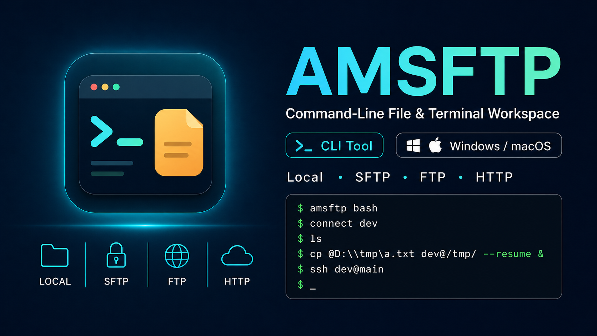

# AMSFTP

[English](./README.md) | [Simplified Chinese](./README.zh-CN.md)



AMSFTP is a C++20 command-line workspace for file operations and terminal access across local, SFTP, FTP, and HTTP targets. It is designed as a compact alternative to switching between `ssh`, `sftp`, shell scripts, and ad-hoc transfer tools.

The project is approaching its first public release. The active implementation lives under `src/`; old migration notes, deprecated prototypes, and local build artifacts are intentionally excluded from the release tree.

## Current Features

- Local, SFTP, FTP, and HTTP download client workflows
- Saved host profiles and quick client switching
- File commands including `stat`, `ls`, `size`, `find`, `mkdir`, `rm`, `tree`, `realpath`, `cp`, `mv`, `rn`, `clone`, and `wget`
- Asynchronous transfer tasks with `task ls`, `task inspect`, `task pause`, `task resume`, and `task terminate`
- Interactive mode through `bash`
- SSH/local terminal sessions through `ssh` and `term`
- Isocline-based completion, highlighting, and command history
- Styled terminal output and configurable prompt profiles

## Build Requirements

- CMake 3.20 or newer
- Ninja
- Rust and `cargo`
- OpenSSL, ZLIB, CURL, nlohmann_json, Lua, libssh2, and CLI11

On Windows, install dependencies with vcpkg for the selected triplet and set `VCPKG_ROOT` before configuring:

```powershell
$env:VCPKG_ROOT = "D:\Compiler\vcpkg"
```

The Windows presets use `clang-cl`, `llvm-rc`, and `$env{VCPKG_ROOT}/scripts/buildsystems/vcpkg.cmake`.

On macOS, the bundled arm64 presets expect Homebrew packages and static pkg-config metadata under `/opt/homebrew`.

## Build

### Windows

Configure the release preset:

```powershell
cmake --preset windows-msvc-release
```

Build the executable:

```powershell
cmake --build --preset windows-msvc-release --target amsftp
```

The Windows release executable is generated at:

```text
build/windows-msvc-release/amsftp.exe
```

### macOS

Configure the arm64 release preset:

```sh
cmake --preset macos-arm64-release
```

Build the executable:

```sh
cmake --build --preset macos-arm64-release --target amsftp
```

The macOS release executable is generated at:

```text
build/macos-arm64-release/amsftp
```

CMake builds the Rust helper crate in `src/foreign/amsrust` automatically through `cargo build --release --locked`.

Before publishing a release, check these values in `CMakeLists.txt`:

- `AMSFTP_PROGRAM_VERSION`
- `AMSFTP_PASSWORD_KEY`
- `AMSFTP_APP_DESCRIPTION_TEXT`

## First Run

AMSFTP requires `AMSFTP_ROOT` to point to a writable runtime directory:

```powershell
$env:AMSFTP_ROOT = "D:\Data\amsftp"
```

Start interactive mode:

```powershell
.\build\win-clang-static-release\amsftp.exe bash
```

Or inspect the command surface first:

```powershell
.\build\win-clang-static-release\amsftp.exe --help
```

On first run, AMSFTP initializes runtime configuration under `AMSFTP_ROOT`, including:

- `config/config.toml`
- `config/settings.toml`
- `config/known_hosts.toml`
- `config/history.toml`
- `config/bak/`

## Examples

Create and connect to clients:

```text
host add dev
profile edit dev
local self
sftp dev user@example.com -P 22
ftp ftpbox user@example.com -P 21
connect dev
ch dev
```

Run file operations:

```text
ls
stat dev@/var/log/syslog
find dev@/var/log "*.log"
mkdir dev@/tmp/upload
cp @D:\tmp\a.txt dev@/tmp/
clone dev@/data/file.bin @D:\backup\file.bin --resume
wget https://example.com/file.zip @D:\tmp\file.zip --resume
```

Run transfers in the background by appending `&`:

```text
cp @D:\tmp\large.zip dev@/tmp/ --resume &
task ls
task inspect 1
task pause 1
task resume 1
```

Manage terminal sessions:

```text
term add dev@main
ssh dev@main
term ls
term rm dev@main
```

## Path Syntax

Many commands accept `nickname@path` targets:

- `dev@/var/log/syslog` uses the `dev` client
- `@D:\tmp\a.txt` uses the local client
- `/tmp/a.txt` uses the current client
- `@` refers to the local current directory

Interactive input uses the backtick as the escape character:

```text
stat dev@/tmp/a`@b.txt
stat dev@/tmp/price`$1.txt
stat "dev@/tmp/name with spaces.txt"
rm -- -file-starting-with-dash.txt
```

## Variables

Variables are resolved only in path-like arguments, not as general command macros.

```text
var def ${dev:logs} /var/log
var def --global $cache @D:\cache
find dev@${dev:logs} "*.log"
cp dev@${dev:logs}/app.log @D:\logs\app.log
```

## Interactive Keys

### Isocline Input

- `Tab`: open completion or complete the current token
- `End`: accept an inline completion hint
- `Up` / `Down`: navigate history when the cursor is on the first or last input row
- `Ctrl+R` / `Ctrl+S`: search history
- `Ctrl+C`: cancel prompt input or interrupt a cancellable operation

### Terminal Control Mode

- `Ctrl+]`: enter control mode from an active terminal session
- `e` or `Esc`: leave control mode and return to the terminal session
- `q`: detach from the foreground terminal session
- `Tab` / `Right`: switch to the next terminal session
- `Shift+Tab` / `Left`: switch to the previous terminal session
- `Up` / `Down`: scroll terminal history by one row
- `Page Up` / `Page Down`: scroll terminal history by one page
- `Home`: jump to the oldest cached terminal history
- `End`: return to live terminal output
