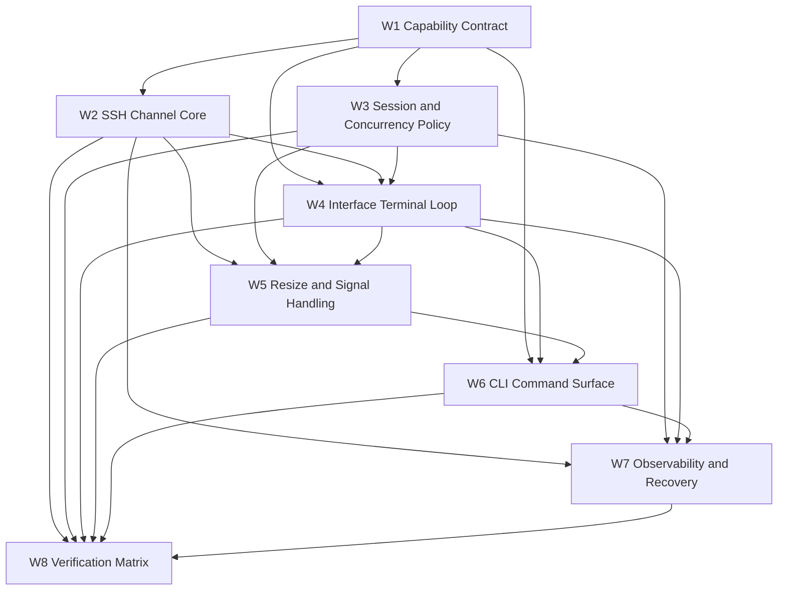

# Terminal Workflow Contract

This document defines how parallel subagents coordinate the interactive SSH terminal implementation for `AMSFTP`.

## Scope

- Target feature: a real interactive SSH terminal backed by a `libssh2` session and PTY shell channel.
- Supported behaviors: full-screen TUI apps, password prompts, raw byte forwarding, resize handling, clean return to the CLI prompt.
- Non-goals for this phase: rewrite of `ConductCmd`, prompt redesign, or unrelated client protocol refactors.

## Repository Rules To Preserve

- Keep application-layer code free of prompt, print, and render logic.
- Keep protocol/platform bindings in infrastructure.
- Keep DTOs owned by the application layer if consumed by interface code.
- Keep bootstrap as wiring only.
- Prefer vertical slices over large cross-cutting rewrites.

## Workflow DAG

### Immediate Start

These workflows can start in parallel:

- `W1` Capability Contract
- `W2` SSH Channel Core
- `W3` Session and Concurrency Policy
- `W7` Observability and Recovery

### Blocked Until W1 Is Stable

- `W4` Interface Terminal Loop
- `W5` Resize and Signal Handling
- `W6` CLI Command Surface

### Blocked Until Core + Interface Are Stable

- `W8` Verification Matrix

### Dependency Graph



## Workflow Contracts

### W1 Capability Contract

- Owns terminal DTOs and `IClientIOPort` terminal signatures.
- Output:
  - `TerminalOpenArgs`, `TerminalReadArgs`, `TerminalWriteArgs`, `TerminalResizeArgs`, `TerminalCloseArgs`
  - `TerminalOpenResult`, `TerminalReadResult`, `TerminalWriteResult`, `TerminalCloseResult`
  - error mapping rules and unsupported-protocol behavior
- Constraint:
  - Must not encode UI policy or raw-terminal rendering details.
- Exit criterion:
  - One stable terminal API surface that other workflows can compile against conceptually.

### W2 SSH Channel Core

- Owns the `libssh2` PTY and shell session mechanics.
- Output:
  - non-blocking shell channel lifecycle
  - read/write/close helpers
  - exit-status collection
  - remote EOF handling
- Constraint:
  - Must not depend on interface-layer prompt code.
- Exit criterion:
  - Shell channel can be opened, used, resized, and closed reliably.

### W3 Session and Concurrency Policy

- Owns the decision for shared session vs dedicated terminal session.
- Output:
  - exclusivity rules
  - lock ordering
  - terminal-active state
  - reconnect and interruption policy
- Constraint:
  - Must resolve how interactive shell mode coexists with file I/O and connection recovery.
- Exit criterion:
  - No ambiguous ownership of socket/session state.

### W4 Interface Terminal Loop

- Owns the raw local TTY bridge.
- Output:
  - stdin read loop
  - stdout/stderr render path
  - raw mode guard
  - terminal restore path
- Constraint:
  - Must keep raw bytes raw; no prompt styling or BBCode parsing in the terminal stream.
- Exit criterion:
  - Local shell can pass through bytes for `vim`, `htop`, password prompts, and similar apps.

### W5 Resize and Signal Handling

- Owns terminal size propagation and signal behavior.
- Output:
  - resize detection
  - PTY resize request path
  - local interrupt forwarding policy
  - platform fallback behavior
- Constraint:
  - Must preserve the app's existing interrupt model outside terminal mode.
- Exit criterion:
  - Local resize updates the remote PTY without corrupting the session.

### W6 CLI Command Surface

- Owns the user-facing command entry and exit flow.
- Output:
  - `term`/`ssh`-style command entry
  - CLI parse wiring
  - help text
  - clean exit back to the prompt
- Constraint:
  - Must not embed terminal transport logic inside CLI parsing.
- Exit criterion:
  - The user can enter interactive SSH mode from the current client context.

### W7 Observability and Recovery

- Owns traces, diagnostics, and cleanup semantics.
- Output:
  - trace points for open/read/write/resize/close
  - partial-init cleanup rules
  - actionable error messages
- Constraint:
  - Must not spam the user with low-value logs.
- Exit criterion:
  - Terminal failures are explainable and leave the client usable when possible.

### W8 Verification Matrix

- Owns validation coverage and regression checklist.
- Output:
  - unit tests
  - integration checklist
  - manual scenario matrix
- Constraint:
  - Must map each test to a concrete workflow or bug class.
- Exit criterion:
  - Each workflow has at least one proving test or documented manual check.

## Artifact Interface Contracts

### W1 -> Others

```text
Input:
  - current client protocol
  - terminal capability request
  - control token / timeout policy
Output:
  - terminal DTO names
  - terminal error codes
  - supported/unsupported protocol rules
```

### W2 -> W4 / W5 / W7 / W8

```text
Input:
  - stable terminal API from W1
  - session policy from W3
Output:
  - open/read/write/resize/close behavior
  - error and trace events
  - EOF and exit-status semantics
```

### W3 -> W2 / W4 / W5 / W6 / W7 / W8

```text
Input:
  - repo layering rules
  - existing client/session ownership model
Output:
  - session exclusivity rule
  - lock order
  - reconnect behavior
  - interrupt precedence
```

### W4 -> W5 / W6 / W7 / W8

```text
Input:
  - terminal backend open/read/write/resize contract
  - local raw-mode policy
Output:
  - terminal loop entry point
  - restore semantics
  - local key handling map
```

### W5 -> W6 / W7 / W8

```text
Input:
  - terminal loop lifecycle
  - backend resize API
Output:
  - resize event bridge
  - signal handling rules
  - cross-platform fallback notes
```

### W6 -> W7 / W8

```text
Input:
  - terminal loop API
  - CLI command name and options
Output:
  - user entry/exit flow
  - command help text
  - prompt restoration sequence
```

### W7 -> W8

```text
Input:
  - traces and cleanup semantics
Output:
  - failure diagnostics
  - regression checkpoints
```

## Communication Protocol

- Update cadence:
  - Start of work: one short status note with owner, file(s), and first action.
  - While active: update every 20 to 30 minutes or after any blocking discovery.
  - Before file edits: announce the exact file and why it is changing.
  - After edits: summarize touched symbols and any assumptions.
- Blocker format:
  - `BLOCKER: <short title>`
  - `Impact: <what is blocked>`
  - `Need: <specific input or decision>`
  - `Proposed fallback: <safe fallback if no answer>`
- Escalation path:
  - First: resolve by reading repo context and existing patterns.
  - Second: ask the coordinating worker that owns the dependency.
  - Third: freeze the dependent workflow and mark status as blocked in `status_record.md`.
- Conflict rules:
  - No workflow may rename shared DTOs or change lock policy without W1/W3 agreement.
  - No workflow may edit another workflow’s owned file unless explicitly handed off.
  - No workflow may “fix” a bug by introducing prompt/UI logic into application code.

## Merge And Integration Order

1. Merge `W1` first so the interface is stable.
2. Merge `W3` next so all concurrency assumptions are explicit.
3. Merge `W2` after `W1` and `W3` are aligned.
4. Merge `W4` after `W2` is usable.
5. Merge `W5` after `W2` and `W4` are usable.
6. Merge `W6` after `W4` and `W5` are usable.
7. Merge `W7` after the core path exists and cleanup behavior can be observed.
8. Merge `W8` last, but run it continuously during the integration window.

## Rollback Strategy

- If `W1` changes destabilize downstream work:
  - revert only the contract-facing symbols and keep local exploratory code isolated.
- If `W2` introduces session instability:
  - disable the terminal entry point and fall back to `ConductCmd`.
- If `W4` or `W5` break the user prompt:
  - restore the previous prompt loop and keep the terminal backend behind a feature gate.
- If `W6` introduces CLI ambiguity:
  - keep the command hidden or disabled until the interface contract is stable.
- If `W7` logging causes noise or recursion:
  - reduce it to trace-only and preserve cleanup paths.
- If a rollback is needed:
  - revert the newest workflow first, then back out dependent workflows in reverse merge order.

## Bug Hotspot Watchlist

### libssh2 Nonblocking Session Handling

- Risk: `LIBSSH2_ERROR_EAGAIN` loops that never yield.
- Risk: mixing blocking and non-blocking calls on the same session without a clear boundary.
- Risk: closing a channel while another thread still reads or writes it.
- Risk: exit-status retrieval after the channel is already partially torn down.

### Shared Session And Socket Ownership

- Risk: interactive terminal and file I/O fighting over the same `LIBSSH2_SESSION`.
- Risk: deadlock from recursive locks around `Connect`, `Check`, and terminal I/O.
- Risk: reconnect logic reusing stale terminal state.

### Prompt Raw I/O And Screen State

- Risk: printing styled prompt frames into a raw terminal byte stream.
- Risk: not restoring cursor visibility, alternate screen, or raw mode on exit.
- Risk: async prompt refresh events corrupting terminal output during shell mode.

### Signal Handling

- Risk: treating remote `Ctrl+C` like local app cancellation.
- Risk: `SIGINT`/`SIGWINCH` paths altering global state in terminal mode.
- Risk: platform-specific signal behavior diverging between Windows and POSIX.

### Resize And TTY Translation

- Risk: resize events arriving after the PTY has already been closed.
- Risk: wrong row/column values because local terminal size was cached too long.
- Risk: width/height mismatch causing broken full-screen layouts.

## Acceptance Gates

- W1: terminal APIs are stable and protocol-typed.
- W2: shell channel can be opened, used, resized, and closed.
- W3: concurrency policy is explicit and testable.
- W4: raw terminal bridge preserves byte fidelity.
- W5: resize and interrupt semantics are correct on the target platform.
- W6: users can enter and exit interactive shell mode from the CLI.
- W7: failures are diagnosable and leave the client usable when possible.
- W8: regression coverage exists for happy path and major failure modes.

